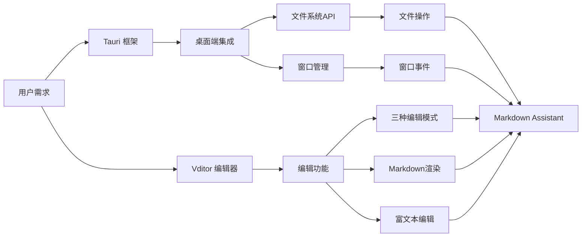
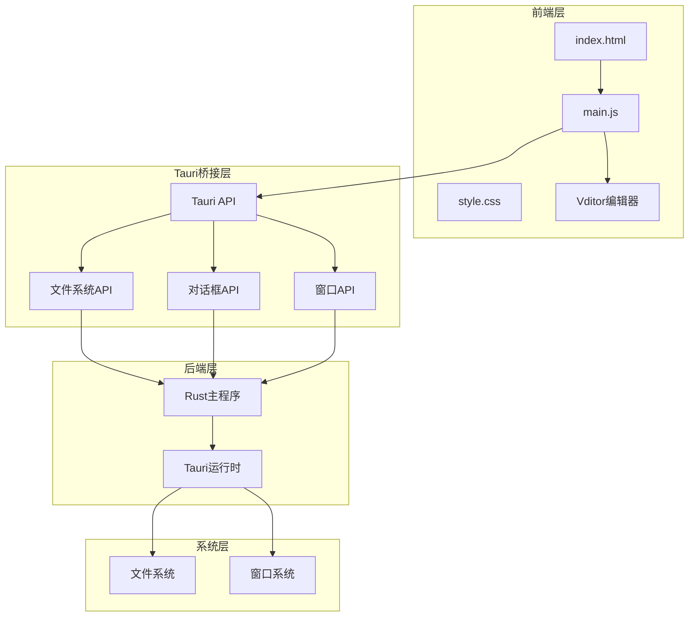
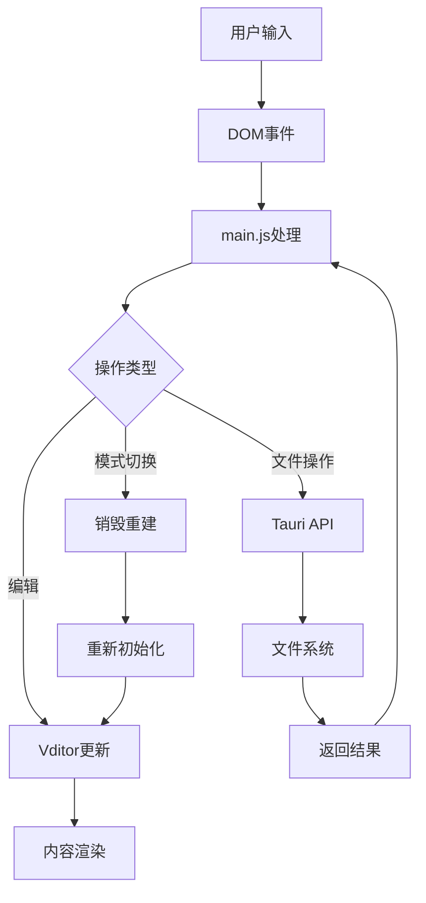
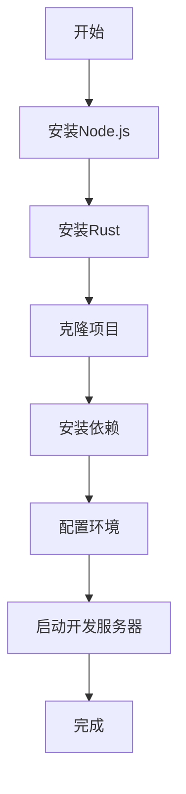
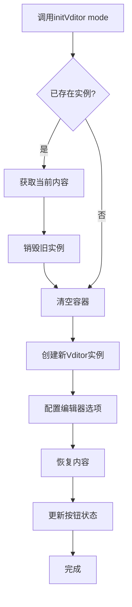
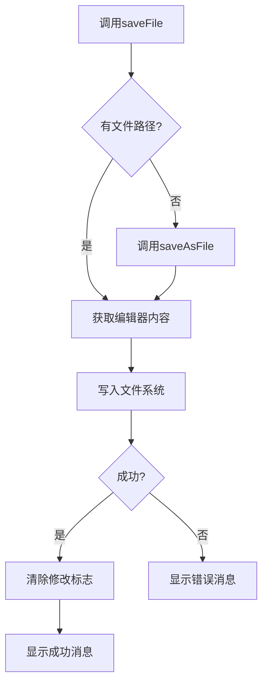
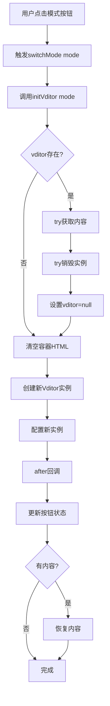
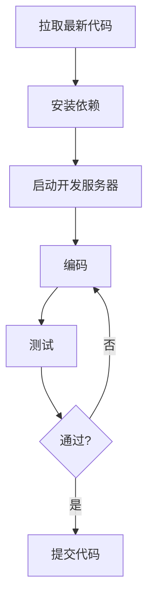
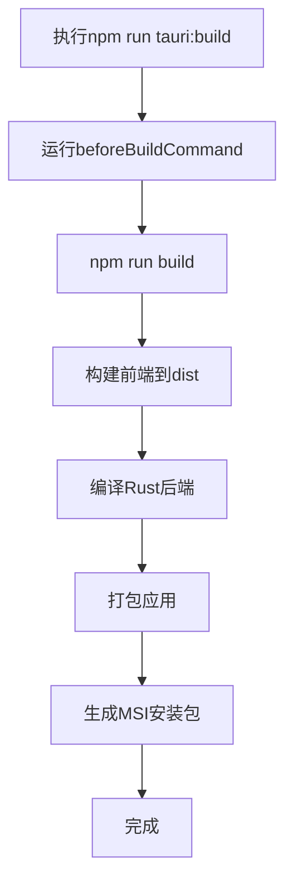

# Markdown Assistant 程序员开发手册

**版本**：1.0.0  
**最后更新**：2026-04-08  
**适用对象**：开发人员、贡献者

---

## 目录

1. [项目概述](#1-项目概述)
2. [技术架构](#2-技术架构)
3. [环境搭建](#3-环境搭建)
4. [项目结构](#4-项目结构)
5. [核心模块详解](#5-核心模块详解)
6. [关键功能实现](#6-关键功能实现)
7. [开发工作流](#7-开发工作流)
8. [构建与部署](#8-构建与部署)
9. [常见问题与解决方案](#9-常见问题与解决方案)
10. [扩展指南](#10-扩展指南)

---

## 1. 项目概述

### 1.1 项目简介

Markdown Assistant 是一个基于 Tauri 框架和 Vditor 编辑器组件开发的本地化 Markdown 编辑器应用。该项目充分发挥 Tauri 在桌面端应用开发中的性能优势与系统集成能力，同时利用 Vditor 丰富的编辑功能集，实现"面向普通用户和开发者的全面兼容"的核心目标。

### 1.2 核心特性

- **三种编辑模式**：WYSIWYG（所见即所得）、IR（即时渲染）、SV（分屏预览）
- **数学公式支持**：基于 KaTeX 的 LaTeX 数学公式渲染
- **图表支持**：内置 Mermaid 支持流程图、甘特图、时序图等
- **代码高亮**：使用 highlight.js 实现多语言代码块高亮
- **本地文件操作**：支持新建、打开、保存、另存为文件
- **纯本地运行**：无需依赖外部服务，所有功能在本地环境高效运行

### 1.3 设计理念



---

## 2. 技术架构

### 2.1 技术栈

| 组件 | 版本 | 用途 |
|------|------|------|
| Tauri | 1.5 | 桌面应用框架 |
| Vditor | 3.10.3 | Markdown 编辑器 |
| Vite | 5.0 | 前端构建工具 |
| Rust | 最新稳定版 | 后端编程语言 |
| KaTeX | 内置 | 数学公式渲染 |
| Mermaid | 内置 | 图表绘制 |
| highlight.js | 内置 | 代码高亮 |

### 2.2 架构图



### 2.3 数据流图



---

## 3. 环境搭建

### 3.1 系统要求

- **操作系统**：Windows 10/11（本项目针对 Windows 优化）
- **Node.js**：v16 或更高版本
- **Rust**：最新稳定版
- **Cargo**：随 Rust 安装
- **包管理器**：npm 或 yarn

### 3.2 安装步骤



#### 步骤详解

1. **安装 Node.js**
   ```powershell
   # 从 https://nodejs.org/ 下载并安装
   node --version
   npm --version
   ```

2. **安装 Rust**
   ```powershell
   # 从 https://www.rust-lang.org/tools/install 下载并安装
   rustc --version
   cargo --version
   ```

3. **克隆项目**
   ```powershell
   cd e:\Developer\TRAE_Projects
   git clone <repository-url>
   cd MarkdownAssistant
   ```

4. **安装依赖**
   ```powershell
   npm install
   ```

5. **启动开发服务器**
   ```powershell
   npm run tauri:dev
   ```

### 3.3 开发工具推荐

- **IDE**：Visual Studio Code 或 JetBrains WebStorm
- **VS Code 扩展**：
  - Tauri
  - rust-analyzer
  - Volar
  - ESLint
  - Prettier

---

## 4. 项目结构

### 4.1 目录结构

```
MarkdownAssistant/
├── src-tauri/              # Tauri Rust 后端
│   ├── src/
│   │   └── main.rs         # Rust 主程序入口
│   ├── Cargo.toml          # Rust 依赖配置
│   ├── build.rs            # 构建脚本
│   └── tauri.conf.json     # Tauri 配置文件
├── dist/                   # 前端构建输出
├── node_modules/           # Node.js 依赖
├── index.html              # 主 HTML 文件
├── main.js                 # 前端核心逻辑
├── style.css               # 样式文件
├── package.json            # Node.js 项目配置
├── vite.config.js          # Vite 配置（如存在）
└── README.md               # 项目说明
```

### 4.2 关键文件说明

| 文件 | 说明 |
|------|------|
| `src-tauri/src/main.rs` | Rust 后端入口点，初始化 Tauri 应用 |
| `src-tauri/tauri.conf.json` | Tauri 应用配置（窗口、构建、权限等） |
| `src-tauri/Cargo.toml` | Rust 依赖管理 |
| `index.html` | 前端 HTML 结构，包含工具栏和编辑器容器 |
| `main.js` | 前端核心逻辑，编辑器初始化、文件操作、模式切换 |
| `style.css` | 应用样式，工具栏、按钮、布局样式 |
| `package.json` | Node.js 依赖和脚本命令 |

---

## 5. 核心模块详解

### 5.1 main.js - 前端核心逻辑

#### 5.1.1 全局变量

```javascript
let vditor;              // Vditor 编辑器实例
let currentFilePath = null; // 当前打开的文件路径
let isModified = false;  // 文件是否已修改标志
```

#### 5.1.2 initVditor() - 编辑器初始化函数

**位置**：`main.js:10-112`

**功能说明**：
- 创建或重新创建 Vditor 编辑器实例
- 支持三种编辑模式：`wysiwyg`、`ir`、`sv`
- 采用"销毁-重建"模式实现可靠的模式切换
- 自动保存和恢复编辑器内容

**实现流程**：


**关键配置项**：
```javascript
vditor = new Vditor('vditor', {
  height: '100%',
  mode: mode,                    // 编辑模式
  theme: 'light',
  icon: 'material',
  preview: {
    hljs: { enable: true },      // 代码高亮
    math: { engine: 'KaTeX' },   // 数学公式
    mermaid: { enable: true },   // Mermaid图表
    markdown: { mermaid: true }
  },
  toolbar: [...],                // 工具栏配置
  after: () => { ... },          // 初始化后回调
  input: () => { ... }           // 输入事件回调
});
```

#### 5.1.3 switchMode() - 模式切换函数

**位置**：`main.js:218-226`

**功能说明**：
- 切换编辑器到指定模式
- 通过调用 `initVditor()` 实现可靠切换

**实现代码**：
```javascript
function switchMode(mode) {
  try {
    console.log('Switching to mode:', mode);
    initVditor(mode);
    console.log('Mode switched successfully');
  } catch (error) {
    console.error('Failed to switch mode:', error);
  }
}
```

#### 5.1.4 文件操作函数

| 函数 | 位置 | 功能 |
|------|------|------|
| `newFile()` | 128-140 | 创建新文件 |
| `openFile()` | 142-165 | 打开现有文件 |
| `saveFile()` | 167-181 | 保存文件 |
| `saveAsFile()` | 183-206 | 另存为文件 |

**文件保存流程**：


#### 5.1.5 窗口关闭处理

**位置**：`main.js:261-273`

**功能说明**：
- 监听窗口关闭请求
- 检查文件是否已修改
- 显示确认对话框
- 避免异步/await 在同步事件处理程序中导致的死锁

**关键实现**：
```javascript
appWindow.onCloseRequested((event) => {
  if (isModified) {
    event.preventDefault();
    confirm('文件尚未保存，确定要退出吗？', {
      title: '确认退出',
      type: 'warning'
    }).then((confirmed) => {
      if (confirmed) {
        appWindow.close();
      }
    });
  }
});
```

### 5.2 index.html - 页面结构

**位置**：`index.html:1-41`

**结构说明**：
```html
<div class="app-container">
  <div class="toolbar">
    <div class="toolbar-left">    <!-- 文件操作按钮 -->
    <div class="toolbar-center">  <!-- 文件名显示 -->
    <div class="toolbar-right">   <!-- 模式切换按钮 -->
  </div>
  <div id="vditor" class="editor-container"></div>
</div>
```

### 5.3 main.rs - Rust 后端

**位置**：`src-tauri/src/main.rs:1-7`

**功能说明**：
- Rust 程序入口点
- 初始化 Tauri 应用
- 生成配置上下文

**代码**：
```rust
#![cfg_attr(not(debug_assertions), windows_subsystem = "windows")]

fn main() {
    tauri::Builder::default()
        .run(tauri::generate_context!())
        .expect("error while running tauri application");
}
```

---

## 6. 关键功能实现

### 6.1 模式切换 - 销毁重建方案

#### 6.1.1 问题背景

Vditor 3.10.3 的 `setMode()` API 在某些情况下存在不稳定性，导致 WYSIWYG 和 IR 模式切换失效。

#### 6.1.2 解决方案

采用"销毁-重建"模式：
1. 保存当前编辑器内容
2. 销毁旧的 Vditor 实例
3. 清空容器 DOM
4. 使用新模式创建新实例
5. 恢复之前保存的内容

#### 6.1.3 实现流程图



### 6.2 窗口关闭事件处理

#### 6.2.1 问题背景

在同步的 `onCloseRequested` 事件处理程序中使用 `async/await` 会导致死锁，应用无法正常关闭。

#### 6.2.2 解决方案

使用 Promise `.then()` 链式调用替代 `async/await`：

```javascript
// ❌ 错误做法：会导致死锁
appWindow.onCloseRequested(async (event) => {
  if (isModified) {
    event.preventDefault();
    const confirmed = await confirm(...);
    if (confirmed) {
      appWindow.close();
    }
  }
});

// ✅ 正确做法：使用 Promise 链
appWindow.onCloseRequested((event) => {
  if (isModified) {
    event.preventDefault();
    confirm(...).then((confirmed) => {
      if (confirmed) {
        appWindow.close();
      }
    });
  }
});
```

### 6.3 Tauri API 使用

#### 6.3.1 对话框 API

```javascript
import { open, save, confirm, message } from '@tauri-apps/api/dialog';

// 打开文件对话框
const selected = await open({
  multiple: false,
  filters: [{ name: 'Markdown', extensions: ['md', 'markdown'] }]
});

// 保存文件对话框
const filePath = await save({
  filters: [{ name: 'Markdown', extensions: ['md'] }]
});

// 确认对话框
const confirmed = await confirm('消息', { title: '标题', type: 'warning' });

// 消息提示
message('保存成功', { type: 'success' });
```

#### 6.3.2 文件系统 API

```javascript
import { readTextFile, writeTextFile } from '@tauri-apps/api/fs';

// 读取文件
const content = await readTextFile(filePath);

// 写入文件
await writeTextFile(filePath, content);
```

#### 6.3.3 窗口 API

```javascript
import { appWindow } from '@tauri-apps/api/window';

// 监听关闭请求
appWindow.onCloseRequested((event) => { ... });

// 关闭窗口
appWindow.close();
```

---

## 7. 开发工作流

### 7.1 日常开发流程



### 7.2 开发命令

| 命令 | 说明 |
|------|------|
| `npm run dev` | 启动 Vite 开发服务器（仅前端） |
| `npm run tauri:dev` | 启动 Tauri 开发模式（完整应用） |
| `npm run build` | 构建前端 |
| `npm run tauri:build` | 构建完整应用（MSI 安装包） |

### 7.3 调试技巧

#### 7.3.1 前端调试

1. **打开开发者工具**：在开发模式下按 `F12` 或 `Ctrl+Shift+I`
2. **Console 日志**：使用 `console.log()` 输出调试信息
3. **断点调试**：在 Sources 面板设置断点

#### 7.3.2 Rust 后端调试

1. **查看构建输出**：终端会显示 Rust 编译信息
2. **日志记录**：使用 `println!()` 输出调试信息（仅开发模式）

---

## 8. 构建与部署

### 8.1 构建配置

#### 8.1.1 tauri.conf.json 关键配置

```json
{
  "build": {
    "distDir": "../dist",
    "beforeBuildCommand": "npm run build"
  },
  "package": {
    "productName": "Markdown Assistant",
    "version": "1.0.0"
  },
  "tauri": {
    "bundle": {
      "targets": ["msi"],
      "identifier": "com.markdownassistant.app"
    },
    "windows": {
      "certThumbprint": null,
      "timestampUrl": null
    }
  }
}
```

### 8.2 构建流程



### 8.3 构建输出

构建成功后，安装包位于：
```
src-tauri/target/release/bundle/msi/Markdown Assistant_1.0.0_x64_en-US.msi
```

可执行文件位于：
```
src-tauri/target/release/Markdown Assistant.exe
```

---

## 9. 常见问题与解决方案

### 9.1 Tauri 配置错误

**问题**：`tauri.conf.json` error on `build`: Additional properties are not allowed ('frontendDist' was unexpected)

**原因**：Tauri 1.x 使用 `distDir` 而不是 `frontendDist`

**解决方案**：
```json
// ❌ 错误
"build": { "frontendDist": "../dist" }

// ✅ 正确
"build": { "distDir": "../dist" }
```

### 9.2 API 导入错误

**问题**：`"dialog" is not exported by "@tauri-apps/api/dialog"`

**原因**：Tauri 1.x 的 API 导入方式变化

**解决方案**：
```javascript
// ❌ 错误
import { open, save, dialog, message } from '@tauri-apps/api/dialog';

// ✅ 正确
import { open, save, confirm, message } from '@tauri-apps/api/dialog';
```

### 9.3 打包错误

**问题**：`failed to bundle project: error running light.exe`

**原因**：缺少必需的图标文件

**解决方案**：从 `tauri.conf.json` 的 `bundle` 配置中移除 `icon` 数组，或提供正确的图标文件。

### 9.4 模式切换不生效

**问题**：只能工作在 SV 模式，IR、WYSIWYG 模式切换无效

**原因**：Vditor 3.10.3 的 `setMode()` API 存在兼容性问题

**解决方案**：使用"销毁-重建"模式，详见 [6.1 节](#61-模式切换---销毁重建方案)

### 9.5 窗口关闭时冻结

**问题**：点击关闭按钮时应用冻结或死锁

**原因**：在同步的关闭事件处理程序中使用了 `async/await`

**解决方案**：使用 Promise `.then()` 链式调用，详见 [6.2 节](#62-窗口关闭事件处理)

---

## 10. 扩展指南

### 10.1 添加新功能

#### 10.1.1 添加自定义工具栏按钮

1. 在 `index.html` 中添加按钮
2. 在 `main.js` 中添加事件监听器
3. 实现相应功能

#### 10.1.2 配置 Vditor 工具栏

```javascript
toolbar: [
  'emoji', 'headings', 'bold', 'italic', 'strike', '|',
  'line', 'quote', 'list', 'ordered-list', 'check', '|',
  'code', 'inline-code', 'link', 'image', 'table', 'mermaid', '|',
  'edit-mode', 'both', 'preview', '|',
  'fullscreen', 'read-mode', 'help'
]
```

### 10.2 添加 Tauri 命令

如需从前端调用 Rust 后端功能：

1. 在 `src-tauri/src/main.rs` 中定义命令
2. 在 `tauri::Builder` 中注册命令
3. 在前端通过 `@tauri-apps/api/tauri` 调用

### 10.3 自定义主题

1. 修改 `style.css` 添加自定义样式
2. 在 Vditor 配置中指定主题路径
3. 参考 Vditor 官方文档了解主题定制方法

---

## 附录

### A. 参考资源

- [Tauri 官方文档](https://tauri.app/v1/guides/)
- [Vditor 官方文档](https://b3log.org/vditor/)
- [Rust 官方文档](https://www.rust-lang.org/learn)
- [Vite 官方文档](https://vitejs.dev/)

### B. 版本历史

| 版本 | 日期 | 说明 |
|------|------|------|
| 1.0.0 | 2026-04-08 | 初始版本 |

### C. 联系方式

如有问题或建议，请通过项目仓库提交 Issue。
