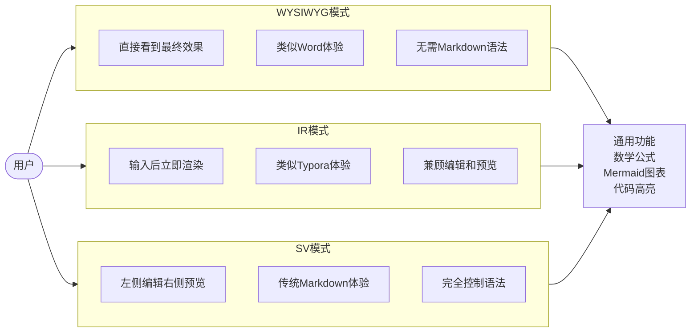
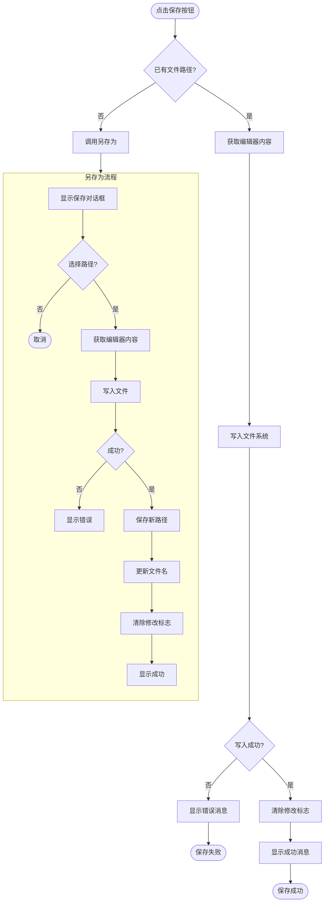
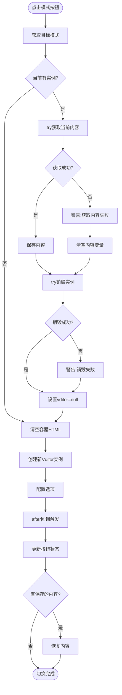
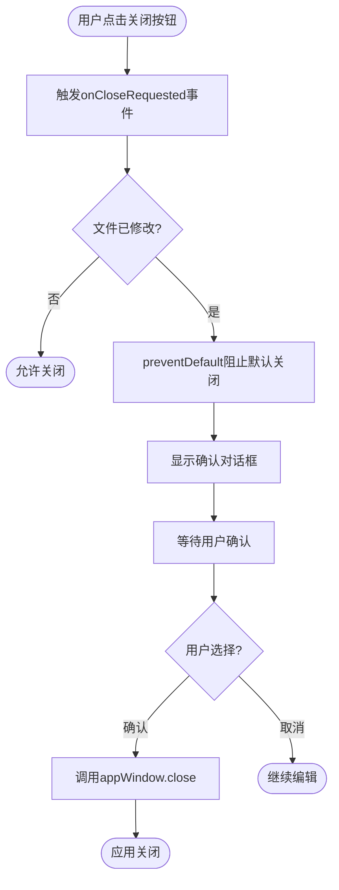
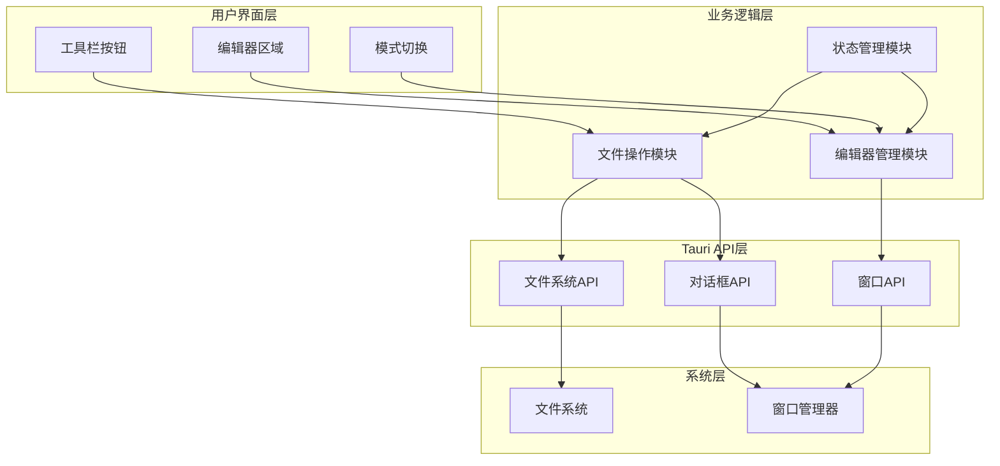
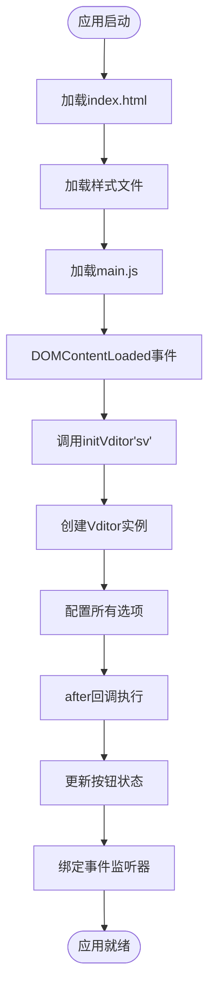
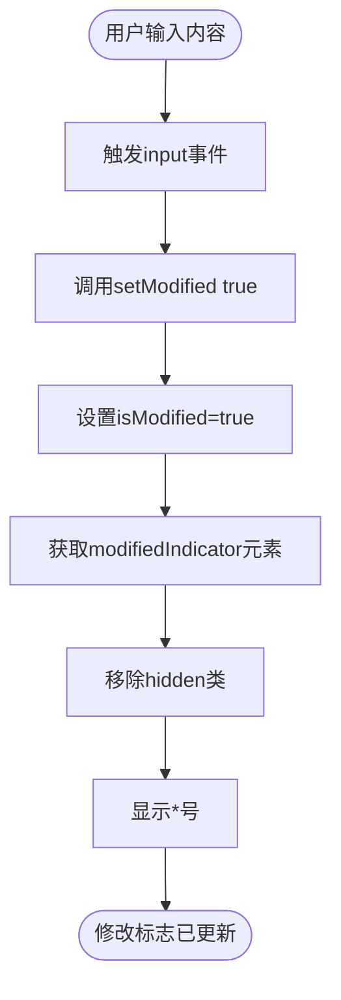
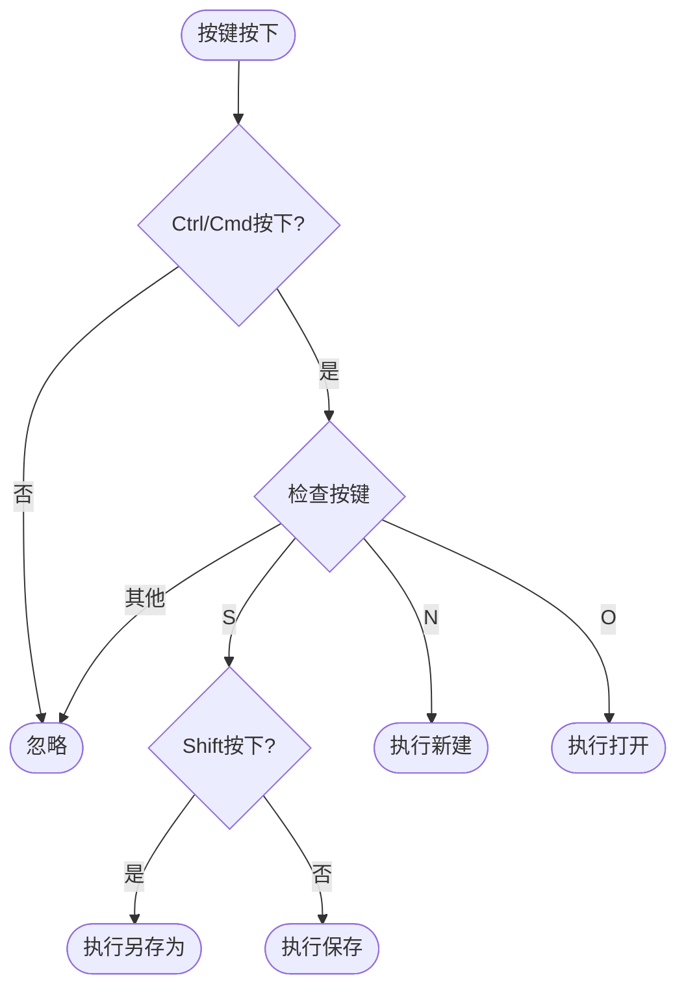
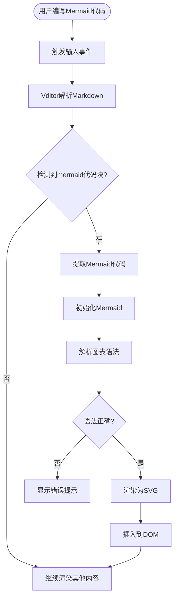
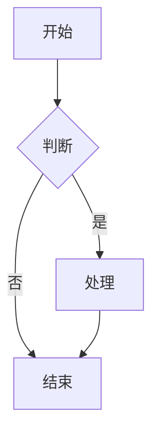

# Mermaid 流程图示例

本文件包含 Markdown Assistant 中使用的各种 Mermaid 流程图示例。

---

## 1. 整体应用工作流

```mermaid
flowchart TD
    Start([启动应用]) --> Init[初始化Vditor编辑器]
    Init --> Load{是否有未保存文件?}
    Load -->|是| ShowLast[显示上次编辑内容]
    Load -->|否| ShowEmpty[显示空白编辑器]
    ShowLast --> EditLoop
    ShowEmpty --> EditLoop
    
    subgraph EditLoop [编辑循环]
        direction TB
        Edit[用户编辑内容] --> CheckSave{需要保存?}
        CheckSave -->|是| SaveFile[保存文件]
        CheckSave -->|否| CheckMode{切换模式?}
        SaveFile --> CheckMode
        CheckMode -->|是| SwitchMode[切换编辑模式]
        CheckMode -->|否| CheckClose{关闭应用?}
        SwitchMode --> CheckClose
        CheckClose -->|否| Edit
    end
    
    CheckClose -->|是| CheckModified{文件已修改?}
    CheckModified -->|是| ShowConfirm[显示确认对话框]
    CheckModified -->|否| Exit([退出应用])
    ShowConfirm -->{确认退出?}
    -->|是| Exit
    -->|否| Edit
```

---

## 2. 三种编辑模式对比



---

## 3. 新建文件流程

```mermaid
flowchart TD
    ClickNew([点击新建按钮]) --> Check{当前文件已修改?}
    Check -->|是| ShowConfirm[显示确认对话框]
    ShowConfirm -->{确认继续?}
    -->|否| Cancel([取消操作])
    -->|是| Clear[清空编辑器]
    Check -->|否| Clear
    Clear --> ResetPath[重置文件路径]
    ResetPath --> UpdateName[更新文件名显示]
    UpdateName --> ClearFlag[清除修改标志]
    ClearFlag --> Done([完成，可以开始编辑])
```

---

## 4. 打开文件流程

```mermaid
flowchart TD
    ClickOpen([点击打开按钮]) --> CheckModified{当前文件已修改?}
    CheckModified -->|是| ShowConfirm[显示确认对话框]
    ShowConfirm -->{确认继续?}
    -->|否| Cancel([取消操作])
    -->|是| ShowDialog
    CheckModified -->|否| ShowDialog[显示文件选择对话框]
    
    ShowDialog --> SelectFile{用户选择文件?}
    SelectFile -->|否| Cancel
    SelectFile -->|是| ReadFile[读取文件内容]
    
    ReadFile --> Success{读取成功?}
    Success -->|否| ShowError[显示错误消息]
    ShowError --> Done([操作结束])
    Success -->|是| SetContent[设置编辑器内容]
    
    SetContent --> SavePath[保存文件路径]
    SavePath --> ExtractName[提取文件名]
    ExtractName --> UpdateDisplay[更新文件名显示]
    UpdateDisplay --> ClearFlag[清除修改标志]
    ClearFlag --> OpenDone([文件打开成功])
```

---

## 5. 保存文件流程



---

## 6. 模式切换详细流程



---

## 7. 窗口关闭处理流程



---

## 8. 系统架构分层



---

## 9. 初始化流程



---

## 10. 内容修改检测



---

## 11. 键盘快捷键处理



---

## 12. Mermaid 图表渲染流程



---

## 使用说明

以上所有流程图都可以直接在 Markdown Assistant 中渲染显示。只需将代码块复制到编辑器中，选择包含 Mermaid 支持的编辑模式即可查看效果。

### 基本语法



### 节点类型

- `[文本]` - 矩形节点
- `([文本])` - 圆角矩形（开始/结束）
- `{文本}` - 菱形（判断）
- `[[文本]]` - 子程序
- `[(文本)]` - 数据库

### 连线方向

- `TD` - 从上到下
- `LR` - 从左到右
- `TB` - 从上到下（同TD）
- `BT` - 从下到上
- `RL` - 从右到左
