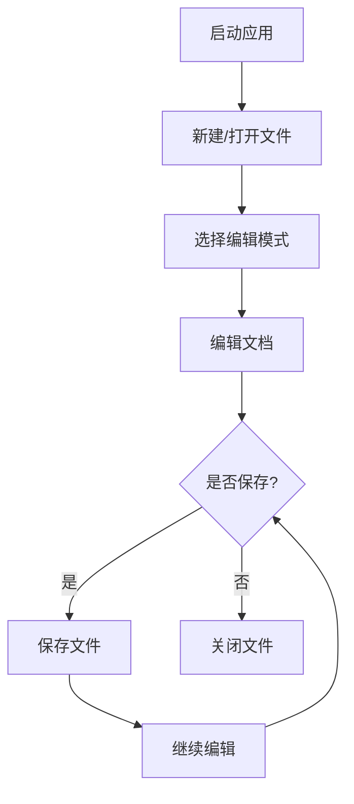

# Markdown Assistant

一个基于 Tauri 和 Vditor 开发的专业 Markdown 桌面编辑器。

---

## 功能特性

### 核心功能

- ✅ **多模式编辑**
  - WYSIWYG（所见即所得）模式
  - IR（即时渲染）模式
  - SV（分屏预览）模式

- ✅ **主题系统**
  - 浅色主题（☀️）
  - 深色主题（🌙）
  - 灰色主题（🌫️）
  - 主题偏好持久化

- ✅ **文件管理**
  - 新建文件
  - 打开本地文件
  - 保存/另存为
  - 关闭文件
  - 未保存修改提示

- ✅ **历史记录**
  - 自动记录最近打开的文件
  - 快速访问历史文件
  - 清除历史记录

- ✅ **PDF 导出**
  - 支持多种页面大小（A4、Letter、Legal）
  - 支持纵向/横向
  - 支持边距设置

### 编辑特性

- 📝 **富文本编辑**：加粗、斜体、删除线等
- 💻 **代码高亮**：支持多种编程语言
- 📐 **数学公式**：KaTeX 数学公式渲染
- 📊 **流程图**：Mermaid 流程图绘制
- 📋 **表格编辑**：方便的表格创建和编辑
- 🖼️ **图片插入**：支持本地和网络图片
- 📑 **TOC 目录**：自动生成文档目录

---

## 快速开始

### 环境要求

- Windows 10 及以上
- Node.js 16+
- Rust（用于 Tauri 开发）

### 安装

```bash
# 克隆项目
git clone <repository-url>
cd MarkdownAssistant

# 安装依赖
npm install
```

### 开发

```bash
# 启动开发服务器
npm run tauri:dev
```

### 构建

```bash
# 构建生产版本
npm run tauri:build
```

构建产物位于 `src-tauri/target/release/bundle/msi/`。

---

## 使用指南

### 基本操作流程



### 快捷键

| 快捷键 | 功能 |
|--------|------|
| `Ctrl + N` | 新建文件 |
| `Ctrl + O` | 打开文件 |
| `Ctrl + S` | 保存文件 |
| `Ctrl + Shift + S` | 另存为 |
| `Ctrl + W` | 关闭文件 |
| `Esc` | 关闭弹窗 |

### 主题切换

点击工具栏右侧的主题按钮即可切换主题：
- ☀️ 浅色 - 清爽明亮，适合日间
- 🌙 深色 - 护眼舒适，适合夜间
- 🌫️ 灰色 - 柔和中性，适合长时间阅读

---

## 项目文档

完整文档请查看：

- 📘 **[用户使用手册](./用户使用手册.md)** - 面向普通用户的详细使用指南
- 🔧 **[程序开发手册](./程序开发手册.md)** - 面向开发者的技术文档
- 🔍 **[程序审计评估报告](./程序审计评估报告.md)** - 项目安全和质量评估

---

## 技术栈

- **前端**：Vanilla JavaScript + Vite
- **桌面框架**：Tauri 1.5
- **编辑器**：Vditor 3.10.3
- **PDF 导出**：html2pdf.js 0.14.0
- **后端**：Rust

---

## 项目结构

```
MarkdownAssistant/
├── src-tauri/                 # Tauri 后端代码
│   ├── icons/                 # 应用图标
│   ├── src/
│   │   └── main.rs           # Rust 主程序
│   ├── Cargo.toml             # Rust 依赖配置
│   └── tauri.conf.json        # Tauri 配置
├── index.html                 # 主 HTML
├── main.js                    # 主 JavaScript
├── style.css                  # 样式文件
├── vite.config.js             # Vite 配置
├── package.json               # npm 配置
├── 用户使用手册.md           # 用户手册
├── 程序开发手册.md           # 开发手册
└── 程序审计评估报告.md       # 审计报告
```

---

## 贡献指南

欢迎贡献！请遵循以下步骤：

1. Fork 本仓库
2. 创建特性分支 (`git checkout -b feature/AmazingFeature`)
3. 提交更改 (`git commit -m 'Feat: Add some AmazingFeature'`)
4. 推送到分支 (`git push origin feature/AmazingFeature`)
5. 开启 Pull Request

### 提交规范

提交消息格式：
```
<type>: <subject>

<body>
```

类型：
- `Feat` - 新功能
- `Fix` - 修复 bug
- `Refactor` - 重构
- `Docs` - 文档更新
- `Style` - 代码格式调整
- `Test` - 测试相关
- `Chore` - 构建/工具相关

---

## 许可证

本项目采用 MIT 许可证。详见 [LICENSE](LICENSE) 文件。

---

## 联系方式

- 提交 Issue：[项目 Issues](../../issues)
- 查看文档：参见项目文档部分

---

## 致谢

- [Tauri](https://tauri.app/) - 桌面应用框架
- [Vditor](https://b3log.org/vditor/) - Markdown 编辑器
- [Vite](https://vitejs.dev/) - 构建工具

---

**版本**：1.0.0  
**最后更新**：2026-04-08
