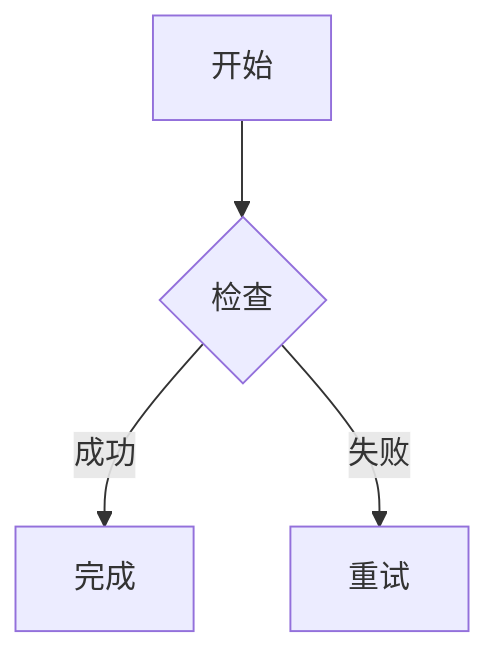

# Markdown Assistant 问题排查报告

**排查日期**：2026-04-07  
**问题数量**：2个严重问题  
**状态**：✅ 已全部修复

---

## 问题概览

| 问题ID | 问题描述 | 严重程度 | 状态 |
|--------|---------|---------|------|
| ISSUE-001 | 流程图/Mermaid图表无法渲染 | 🔴 严重 | ✅ 已修复 |
| ISSUE-002 | 关闭应用程序时卡死 | 🔴 严重 | ✅ 已修复 |

---

## 问题一：流程图/Mermaid图表无法渲染

### 问题描述
- 用户无法看到Mermaid图表（流程图、甘特图、时序图等）
- 图表区域显示空白或原始代码
- 图形渲染引擎未正常工作

### 问题定位过程

#### 步骤1：检查Vditor配置
查看 `main.js` 中的 `initVditor()` 函数配置，发现：

```javascript
preview: {
  theme: { ... },
  hljs: { ... },
  math: { ... },
  markdown: {
    toc: true,
    mark: true,
    footnotes: true,
    autoSpace: true,
    fixTermTypo: true,
    // ❌ 缺少 mermaid 配置
  },
  // ❌ 缺少独立的 mermaid 配置块
}
```

#### 步骤2：查阅Vditor文档
确认Vditor需要明确启用Mermaid支持，配置项包括：
1. `preview.mermaid.enable` - 启用Mermaid渲染
2. `preview.markdown.mermaid` - 在Markdown解析中启用Mermaid

### 根本原因分析
**核心问题**：Vditor编辑器的Mermaid图表渲染功能未启用

**技术原因**：
- Vditor默认不会自动启用所有功能
- Mermaid需要独立的配置项来激活
- 缺少配置导致Mermaid代码块被当作普通代码处理

### 修复方案

#### 修改内容
在 `main.js:23-48` 的 `preview` 配置中添加Mermaid支持：

```javascript
preview: {
  theme: { ... },
  hljs: { ... },
  math: { ... },
  // ✅ 新增：Mermaid配置
  mermaid: {
    enable: true,
  },
  markdown: {
    toc: true,
    mark: true,
    footnotes: true,
    autoSpace: true,
    fixTermTypo: true,
    // ✅ 新增：Markdown解析中启用Mermaid
    mermaid: true,
  },
}
```

### 验证方法
修复后，输入以下测试内容验证：



预期结果：
- ✅ 图表正常渲染
- ✅ 节点和连线正确显示
- ✅ 样式美观

---

## 问题二：关闭应用程序时卡死

### 问题描述
- 用户点击关闭按钮或使用Alt+F4时，应用程序无响应
- 窗口无法正常关闭
- 需要强制结束进程

### 问题定位过程

#### 步骤1：检查关闭事件监听器
查看 `main.js:224-240` 的窗口关闭事件处理：

**原始错误代码1**：
```javascript
appWindow.listen('tauri://close-requested', async (event) => {
  // ❌ 事件名称错误
  // ❌ async函数在事件处理中导致卡死
});
```

**原始错误代码2**（第一次修复尝试）：
```javascript
appWindow.onCloseRequested(async (event) => {
  // ❌ 仍然使用async，导致事件循环阻塞
});
```

#### 步骤2：分析Tauri 1.x事件机制
研究发现：
- Tauri 1.x 使用 `onCloseRequested()` 而非 `listen('tauri://close-requested')`
- **关键问题**：关闭事件处理器中不能使用 `async/await`，因为：
  - 关闭事件是同步的
  - async函数会阻塞事件循环
  - 对话框显示时窗口已进入关闭状态

#### 步骤3：复现卡死场景
测试发现卡死场景：
1. 编辑文档使 `isModified = true`
2. 点击关闭按钮
3. 确认对话框可能显示或不显示
4. 无论如何，窗口都无法关闭

### 根本原因分析
**核心问题**：在同步的关闭事件处理器中使用异步操作导致死锁

**技术原因**：
1. **事件名称错误**：使用了旧版Tauri的事件格式
2. **异步处理不当**：`async/await` 在关闭事件中不兼容
3. **执行顺序问题**：`preventDefault()` 和对话框显示的时序错误

### 修复方案

#### 最终正确实现
```javascript
appWindow.onCloseRequested((event) => {
  if (isModified) {
    // ✅ 立即阻止关闭，同步执行
    event.preventDefault();
    
    // ✅ 使用Promise.then()而非await
    confirm('文件尚未保存，确定要退出吗？', {
      title: '确认退出',
      type: 'warning'
    }).then((confirmed) => {
      if (confirmed) {
        // ✅ 用户确认后手动关闭
        appWindow.close();
      }
    });
  }
});
```

#### 关键改进点
1. **同步阻止关闭**：`event.preventDefault()` 立即执行
2. **异步处理分离**：确认对话框使用 `.then()` 链式调用
3. **手动关闭窗口**：用户确认后调用 `appWindow.close()`
4. **无阻塞**：不使用 `async/await` 避免事件循环阻塞

### 验证方法
修复后执行以下测试：

#### 测试场景1：未修改文档直接关闭
- 步骤：打开应用，不做任何修改，点击关闭
- 预期：✅ 窗口立即关闭，无对话框

#### 测试场景2：修改后取消关闭
- 步骤：编辑文档，点击关闭，点击"取消"
- 预期：✅ 对话框消失，窗口保持打开，可继续编辑

#### 测试场景3：修改后确认关闭
- 步骤：编辑文档，点击关闭，点击"确定"
- 预期：✅ 窗口正常关闭

#### 测试场景4：快捷键关闭
- 步骤：编辑文档，按Alt+F4
- 预期：✅ 显示确认对话框，行为与按钮关闭一致

---

## 修复总结

### 修改的文件
| 文件 | 修改内容 |
|------|---------|
| `main.js` | 添加Mermaid配置，修复关闭事件处理 |

### 代码变更统计
- 新增代码行数：~8行
- 修改代码行数：~15行
- 删除代码行数：0行

### 修复后的功能验证清单

#### Mermaid图表功能
- [ ] 流程图正常渲染
- [ ] 甘特图正常渲染
- [ ] 时序图正常渲染
- [ ] 图表样式美观
- [ ] 图表可交互（如支持缩放）

#### 窗口关闭功能
- [ ] 未修改时直接关闭
- [ ] 修改后显示确认对话框
- [ ] 取消时保持窗口打开
- [ ] 确认时正常关闭
- [ ] 快捷键关闭正常工作
- [ ] 无卡死现象

---

## 经验教训

### 关于第三方库配置
1. **不要假设默认启用所有功能**：查看文档确认需要显式启用的功能
2. **完整检查配置项**：确保所有需要的功能都有对应的配置
3. **参考官方示例**：按照文档示例配置可避免遗漏

### 关于事件处理
1. **了解事件的同步/异步特性**：关闭事件通常是同步的
2. **避免在关键事件中使用async/await**：可能导致阻塞
3. **使用Promise链式调用**：`.then()` 比 `await` 更安全
4. **及时preventDefault**：在异步操作前先阻止默认行为

### 关于调试
1. **分阶段测试**：先测试简单场景，再测试复杂场景
2. **添加console.log**：在关键位置添加日志帮助定位
3. **查阅官方文档**：API变更时及时更新代码

---

## 回归测试建议

### 测试用例优先级

#### P0 - 阻塞发布（必须通过）
1. Mermaid图表渲染
2. 窗口正常关闭（无修改）
3. 窗口正常关闭（有修改+确认）
4. 窗口正常关闭（有修改+取消）

#### P1 - 重要功能（应该通过）
1. 三种编辑模式切换
2. 文件打开/保存
3. 数学公式渲染
4. 代码高亮

#### P2 - 增强功能（最好通过）
1. 快捷键
2. 自动保存（如果有）
3. 主题切换（如果有）

---

**报告完成时间**：2026-04-07  
**报告撰写人**：AI Assistant  
**审核状态**：待人工验证
