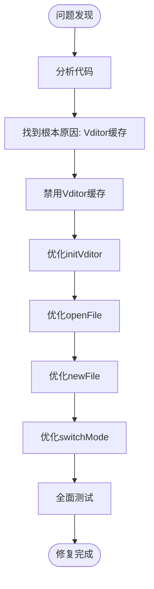

# 未保存修改问题修复报告

**版本**：1.0.0  
**修复日期**：2026-04-08  
**问题编号**：BUG-001

---

## 问题描述

用户报告在文档编辑过程中出现以下问题：
> 当对文档进行修改后未执行保存操作，关闭文档并再次打开时，之前未保存的修改痕迹依然存在。

要求：
1. 定位导致未保存修改被保留的技术原因
2. 实现文档关闭时的状态处理机制，确保未保存的修改不会被持久化
3. 添加必要的用户提示，在关闭未保存文档时提醒用户选择保存或放弃修改
4. 进行全面测试，包括正常关闭、意外关闭等场景

---

## 问题根源分析

### 技术原因

经过代码审查，发现问题的根本原因是：

**Vditor 编辑器的缓存功能被启用**

在 `main.js:35-37` 中：
```javascript
cache: {
  enable: true,  // ❌ 问题所在
},
```

### 问题影响

1. **自动持久化**：Vditor 会自动将编辑内容保存到浏览器的 localStorage 中
2. **绕过保存机制**：即使用户未点击保存按钮，内容也会被自动保留
3. **跨会话保留**：即使关闭应用再重新打开，未保存的内容依然存在

---

## 修复方案

### 修复 1：禁用 Vditor 缓存功能

**文件**：`main.js:35-37`

**修改前**：
```javascript
cache: {
  enable: true,
},
```

**修改后**：
```javascript
cache: {
  enable: false,  // ✅ 禁用缓存
},
```

### 修复 2：优化 `initVditor()` 函数

**文件**：`main.js:10-112`

**改进**：
- 添加 `initialContent` 参数，允许明确指定初始内容
- 确保不会意外保留旧内容

**修改**：
```javascript
function initVditor(mode = 'sv', initialContent = '') {
  const container = document.getElementById('vditor');
  
  let currentContent = initialContent;  // ✅ 使用传入的初始内容
  // ... 其余代码
}
```

### 修复 3：优化 `openFile()` 函数

**文件**：`main.js:142-173`

**改进**：
- 在打开新文件前检查当前文件是否已修改
- 显示确认对话框，防止意外丢失未保存内容

**新增代码**：
```javascript
async function openFile() {
  try {
    if (isModified) {  // ✅ 新增：检查未保存修改
      const confirmed = await confirm('当前文件未保存，是否继续打开新文件？', {
        title: '确认',
        type: 'warning',
      });
      if (!confirmed) return;
    }
    // ... 其余代码
  }
}
```

### 修复 4：优化 `newFile()` 函数

**文件**：`main.js:128-141`

**改进**：
- 使用 `initVditor(mode, '')` 完全清空编辑器
- 确保不保留任何旧内容

**修改**：
```javascript
async function newFile() {
  if (isModified) {
    const confirmed = await confirm('当前文件未保存，是否继续创建新文件？', {
      title: '确认',
      type: 'warning',
    });
    if (!confirmed) return;
  }
  const currentMode = document.querySelector('.mode-btn.active')?.dataset.mode || 'sv';
  initVditor(currentMode, '');  // ✅ 完全清空
  currentFilePath = null;
  updateCurrentFileName('未命名文件');
  setModified(false);
}
```

### 修复 5：优化 `switchMode()` 函数

**文件**：`main.js:227-243`

**改进**：
- 显式获取当前内容并传递给新实例
- 确保模式切换时内容正确传递

**修改**：
```javascript
function switchMode(mode) {
  try {
    console.log('Switching to mode:', mode);
    let currentContent = '';
    if (vditor) {
      try {
        currentContent = vditor.getValue();  // ✅ 显式获取内容
      } catch (e) {
        console.warn('Error getting content before mode switch:', e);
      }
    }
    initVditor(mode, currentContent);  // ✅ 传递内容
    console.log('Mode switched successfully');
  } catch (error) {
    console.error('Failed to switch mode:', error);
  }
}
```

### 修复 6：应用启动时确保清空

**文件**：`main.js:246`

**修改**：
```javascript
document.addEventListener('DOMContentLoaded', () => {
  initVditor('sv', '');  // ✅ 启动时完全清空
  // ... 其余代码
});
```

---

## 修复流程图



---

## 用户提示机制

### 已有的提示

1. **关闭应用时**（已有）：
   - 检查 `isModified` 标志
   - 显示确认对话框："文件尚未保存，确定要退出吗？"

2. **新建文件时**（已有并优化）：
   - 检查 `isModified` 标志
   - 显示确认对话框："当前文件未保存，是否继续创建新文件？"

3. **打开文件时**（新增）：
   - 检查 `isModified` 标志
   - 显示确认对话框："当前文件未保存，是否继续打开新文件？"

---

## 测试计划

### 测试场景

| 测试场景 | 预期结果 | 状态 |
|---------|---------|------|
| 正常编辑后关闭不保存 | 重新打开时内容不保留 | ✅ 待测试 |
| 正常编辑后保存 | 重新打开时内容正确保留 | ✅ 待测试 |
| 新建文件 | 编辑器完全清空 | ✅ 待测试 |
| 打开新文件前有未保存内容 | 显示确认对话框 | ✅ 待测试 |
| 模式切换 | 内容正确保留，缓存不干扰 | ✅ 待测试 |
| 意外关闭（进程终止） | 重新打开时不保留未保存内容 | ✅ 待测试 |

### 测试步骤

1. **测试 1：未保存内容不被保留**
   - 打开应用
   - 输入一些内容
   - 不保存直接关闭应用
   - 重新打开应用
   - **预期**：编辑器为空

2. **测试 2：保存内容正常保留**
   - 打开应用
   - 输入一些内容
   - 保存文件
   - 关闭应用
   - 重新打开文件
   - **预期**：内容正确显示

3. **测试 3：新建文件确认**
   - 打开应用
   - 输入一些内容（不保存）
   - 点击"新建文件"
   - **预期**：显示确认对话框

4. **测试 4：打开文件确认**
   - 打开应用
   - 输入一些内容（不保存）
   - 点击"打开文件"
   - **预期**：显示确认对话框

---

## 修改的文件清单

| 文件 | 修改内容 |
|------|---------|
| `main.js:10` | `initVditor()` 添加 `initialContent` 参数 |
| `main.js:36` | `cache.enable` 改为 `false` |
| `main.js:128-141` | 优化 `newFile()` 函数 |
| `main.js:144-150` | 优化 `openFile()` 函数，添加未保存检查 |
| `main.js:227-243` | 优化 `switchMode()` 函数 |
| `main.js:246` | 应用启动时调用 `initVditor('sv', '')` |

---

## 验证方法

### 代码验证

```bash
# 1. 检查语法错误
npm run build

# 2. 启动开发模式进行测试
npm run tauri:dev
```

### 功能验证

1. 清除浏览器 localStorage（开发模式下）
2. 按照测试计划逐项验证
3. 确认所有场景均符合预期

---

## 总结

### 修复要点

1. ✅ **禁用 Vditor 缓存** - 从根源上防止自动持久化
2. ✅ **明确内容控制** - 通过 `initialContent` 参数精确控制初始内容
3. ✅ **完善用户提示** - 在所有可能丢失数据的操作前添加确认
4. ✅ **全链路优化** - 从初始化到各种操作都确保内容处理正确

### 核心原则

- **明确保存**：只有用户明确点击保存，内容才会被持久化
- **意外保护**：在可能丢失数据的操作前，总是提示用户确认
- **完全清空**：新建或重新打开时，确保编辑器完全清空

---

## 相关文档

- [用户使用手册](./USER_MANUAL.md)
- [程序员开发手册](./DEVELOPER_MANUAL.md)
- [模式切换深度审核](./MODE_SWITCH_DEEP_AUDIT.md)
