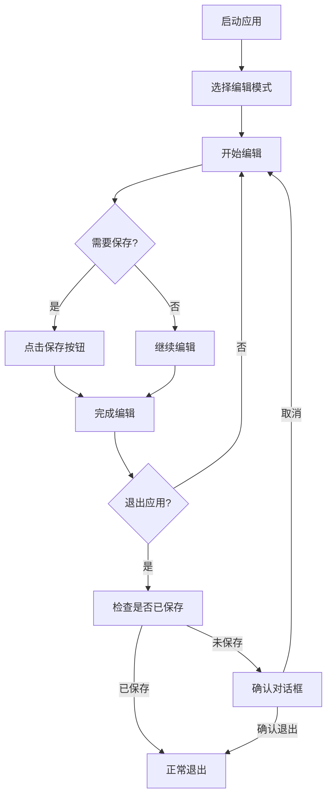
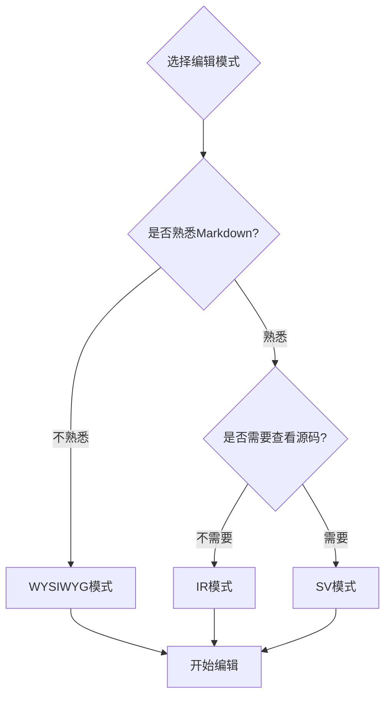
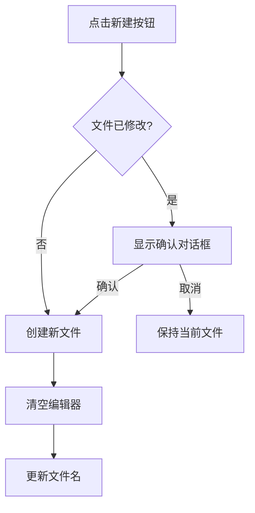
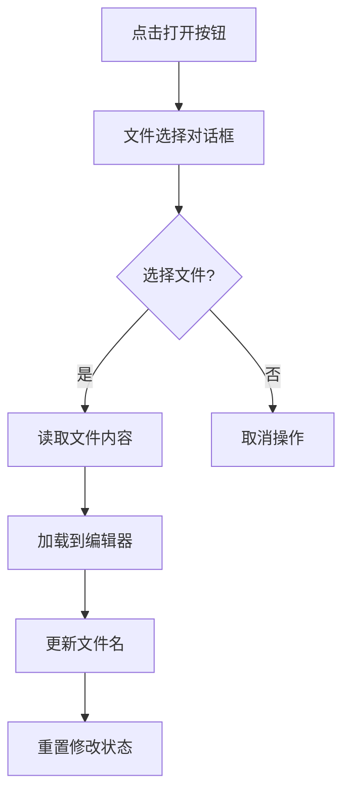
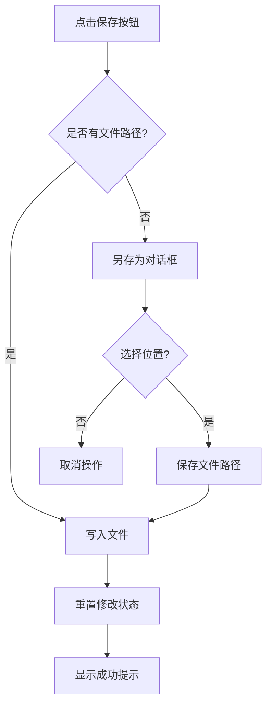
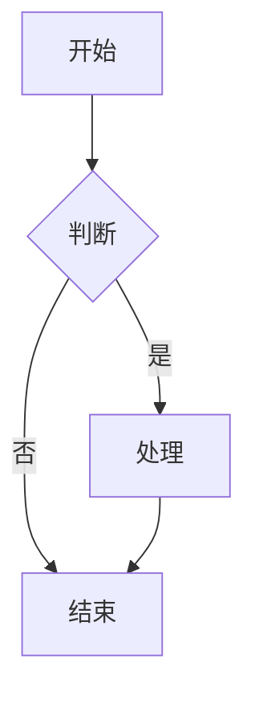
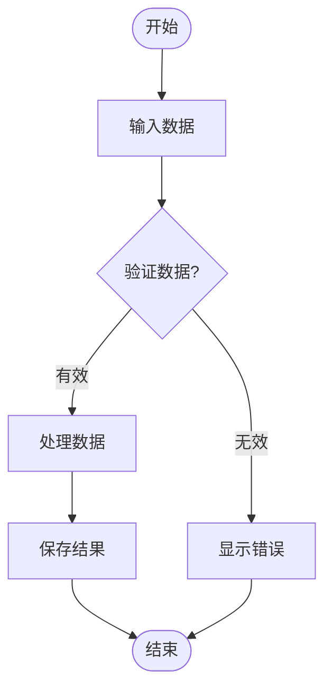
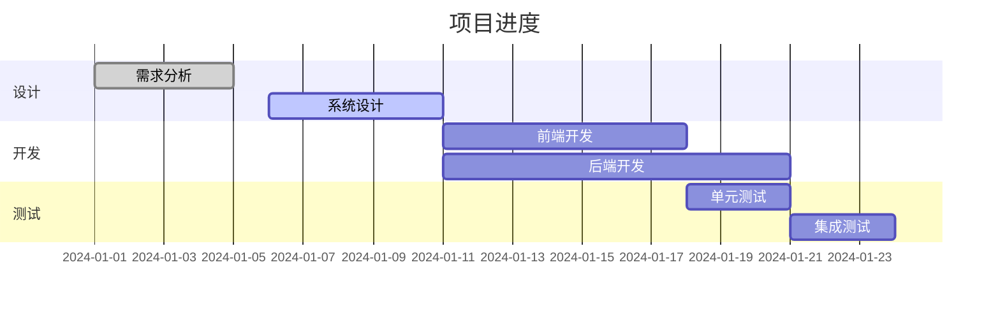
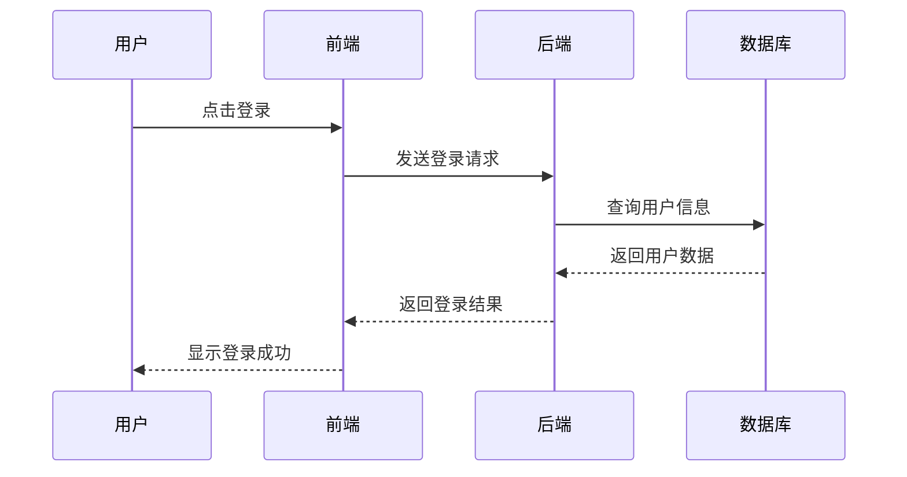

# Markdown Assistant 用户使用手册

**版本**：1.0.0  
**最后更新**：2026-04-08  
**适用对象**：所有用户

---

## 目录

1. [快速入门](#1-快速入门)
2. [三种编辑模式](#2-三种编辑模式)
3. [基本操作](#3-基本操作)
4. [高级功能](#4-高级功能)
5. [数学公式](#5-数学公式)
6. [Mermaid图表](#6-mermaid图表)
7. [代码高亮](#7-代码高亮)
8. [快捷键](#8-快捷键)
9. [常见问题](#9-常见问题)

---

## 1. 快速入门

### 1.1 启动应用

双击 `Markdown Assistant.exe` 启动应用程序。

### 1.2 界面布局

```
┌─────────────────────────────────────────────────────────┐
│  📄 📂 💾 📝   未命名文件   [WYSIWYG] [IR] [SV]  │  ← 工具栏
├─────────────────────────────────────────────────────────┤
│                                                         │
│                    编辑区域                              │
│                                                         │
│                                                         │
└─────────────────────────────────────────────────────────┘
```

### 1.3 工作流程



---

## 2. 三种编辑模式

Markdown Assistant 提供三种编辑模式，满足不同用户的需求。

### 2.1 WYSIWYG 模式（所见即所得）

**适用人群**：不熟悉Markdown语法的普通用户

**特点**：
- 直接看到最终渲染效果
- 类似Word的编辑体验
- 无需学习Markdown语法

**使用场景**：
- 快速笔记
- 简单文档
- 团队协作（非技术人员）

**切换方法**：点击工具栏右侧的 **WYSIWYG** 按钮

### 2.2 IR 模式（即时渲染）

**适用人群**：熟悉Markdown的开发者和高级用户

**特点**：
- 输入后立即渲染
- 类似Typora的体验
- 兼顾编辑和预览

**使用场景**：
- 技术文档
- 博客写作
- 代码文档

**切换方法**：点击工具栏右侧的 **IR** 按钮

### 2.3 SV 模式（分屏预览）

**适用人群**：传统Markdown用户，需要同时查看源码和效果

**特点**：
- 左侧编辑，右侧预览
- 完整控制Markdown源码
- 实时同步更新

**使用场景**：
- 复杂文档
- 学习Markdown
- 需要精确控制格式

**切换方法**：点击工具栏右侧的 **SV** 按钮

### 2.4 模式选择指南



---

## 3. 基本操作

### 3.1 文件操作

#### 新建文件

**操作步骤**：
1. 点击工具栏左侧的 📄 按钮
2. 如果当前文件未保存，会弹出确认对话框
3. 确认后创建新文件

**快捷键**：`Ctrl + N`

**流程图**：


#### 打开文件

**操作步骤**：
1. 点击工具栏左侧的 📂 按钮
2. 在文件选择对话框中选择 .md 或 .markdown 文件
3. 文件内容加载到编辑器中

**快捷键**：`Ctrl + O`

**支持格式**：
- `.md` - Markdown文件
- `.markdown` - Markdown文件

**流程图**：


#### 保存文件

**操作步骤**：
1. 点击工具栏左侧的 💾 按钮
2. 如果是新文件，会弹出"另存为"对话框
3. 选择保存位置和文件名
4. 保存成功后显示提示

**快捷键**：`Ctrl + S`

**流程图**：


#### 另存为

**操作步骤**：
1. 点击工具栏左侧的 📝 按钮
2. 在"另存为"对话框中选择位置和文件名
3. 点击保存

**快捷键**：`Ctrl + Shift + S`

### 3.2 编辑操作

#### 工具栏按钮

| 图标/按钮 | 功能 | 说明 |
|-----------|------|------|
| 😊 | 表情 | 插入表情符号 |
| H | 标题 | 选择标题级别（H1-H6） |
| **B** | 粗体 | 加粗选中文本 |
| *I* | 斜体 | 倾斜选中文本 |
| ~~S~~ | 删除线 | 添加删除线 |
| \| | 分隔线 | 插入分隔线 |
| " | 引用 | 插入引用块 |
| • | 无序列表 | 插入无序列表 |
| 1. | 有序列表 | 插入有序列表 |
| [ ] | 任务列表 | 插入任务列表 |
| ← | 减少缩进 | 减少列表缩进 |
| → | 增加缩进 | 增加列表缩进 |
| `< >` | 代码块 | 插入代码块 |
| `` ` `` | 行内代码 | 插入行内代码 |
| 🔗 | 链接 | 插入链接 |
| 🖼️ | 图片 | 插入图片 |
| 📊 | 表格 | 插入表格 |
| 📈 | Mermaid | 插入Mermaid图表 |

---

## 4. 高级功能

### 4.1 撤销和重做

虽然工具栏没有显示，但可以使用快捷键：
- **撤销**：`Ctrl + Z`
- **重做**：`Ctrl + Shift + Z` 或 `Ctrl + Y`

### 4.2 全屏模式

点击工具栏的全屏按钮，可以进入全屏编辑模式。

### 4.3 阅读模式

点击阅读模式按钮，进入 distraction-free 阅读模式。

### 4.4 修改提示

当文件内容修改后，文件名旁边会显示 **\*** 标记，提醒您保存。

---

## 5. 数学公式

Markdown Assistant 支持 LaTeX 数学公式，使用 KaTeX 引擎渲染。

### 5.1 行内公式

**语法**：
```markdown
$E = mc^2$
```

**示例**：
- 质能方程：$E = mc^2$
- 求根公式：$x = \frac{-b \pm \sqrt{b^2-4ac}}{2a}$
- 求和：$\sum_{i=1}^n i = \frac{n(n+1)}{2}$

### 5.2 块级公式

**语法**：
```markdown
$$
\frac{\partial f}{\partial x} = 2\sqrt{a}x
$$
```

**示例**：

矩阵：
```markdown
$$
\begin{pmatrix}
a & b \\
c & d
\end{pmatrix}
$$
```

积分：
```markdown
$$
\int_0^\infty e^{-x^2} dx = \frac{\sqrt{\pi}}{2}
$$
```

### 5.3 常用公式参考

| 公式 | LaTeX代码 | 说明 |
|------|-----------|------|
| $\alpha$ | `\alpha` | 阿尔法 |
| $\beta$ | `\beta` | 贝塔 |
| $\gamma$ | `\gamma` | 伽马 |
| $\pi$ | `\pi` | 圆周率 |
| $\infty$ | `\infty` | 无穷大 |
| $\pm$ | `\pm` | 正负号 |
| $\times$ | `\times` | 乘号 |
| $\div$ | `\div` | 除号 |
| $\leq$ | `\leq` | 小于等于 |
| $\geq$ | `\geq` | 大于等于 |
| $\neq$ | `\neq` | 不等于 |
| $\sqrt{x}$ | `\sqrt{x}` | 平方根 |
| $\frac{a}{b}$ | `\frac{a}{b}` | 分数 |

---

## 6. Mermaid图表

Markdown Assistant 支持 Mermaid 图表，可以绘制流程图、甘特图、时序图等。

### 6.1 流程图

**语法**：


**方向说明**：
- `TD` - 从上到下（Top to Down）
- `BT` - 从下到上（Bottom to Top）
- `LR` - 从左到右（Left to Right）
- `RL` - 从右到左（Right to Left）

**节点形状**：
- `A[文本]` - 矩形
- `B(文本)` - 圆角矩形
- `C{文本}` - 菱形（判断）
- `D>文本]` - 右向旗帜
- `E[[文本]]` - 子例程
- `F((文本))` - 圆形

**连接线**：
- `-->` - 箭头
- `---` - 直线
- `-.->` - 虚线箭头
- `==>` - 粗箭头

**完整示例**：


### 6.2 甘特图

**语法**：


**关键字说明**：
- `title` - 图表标题
- `dateFormat` - 日期格式
- `section` - 项目阶段
- `:done,` - 已完成
- `:active,` - 进行中
- `:crit,` - 关键路径
- `after des2` - 在某个任务之后
- `5d` - 持续5天

### 6.3 时序图

**语法**：


**参与者**：
- `participant` - 定义参与者
- `actor` - 定义角色（显示为小人）

**消息类型**：
- `->>` - 实线箭头（异步）
- `-->>` - 虚线箭头（返回）
- `->` - 实线（同步）
- `--` - 虚线

**注释**：
- `Note right of 前端: 处理中` - 右侧注释
- `Note left of 后端: 查询数据库` - 左侧注释
- `Note over 用户,数据库: 登录流程` - 跨多个参与者的注释

### 6.4 其他图表类型

Mermaid 还支持：
- 饼图（pie）
- 状态图（stateDiagram）
- 类图（classDiagram）
- ER图（erDiagram）
- 用户旅程图（journey）

---

## 7. 代码高亮

Markdown Assistant 支持多种编程语言的代码高亮，使用 highlight.js。

### 7.1 代码块

**语法**：
```markdown
```语言
代码内容
```
```

### 7.2 支持的语言

| 语言 | 标识 | 示例 |
|------|------|------|
| JavaScript | javascript, js | ```javascript |
| Python | python, py | ```python |
| Java | java | ```java |
| C++ | cpp, c++ | ```cpp |
| C | c | ```c |
| C# | csharp, cs | ```csharp |
| Go | go, golang | ```go |
| Rust | rust, rs | ```rust |
| TypeScript | typescript, ts | ```typescript |
| HTML | html, xml | ```html |
| CSS | css | ```css |
| SQL | sql | ```sql |
| Bash | bash, sh | ```bash |
| JSON | json | ```json |
| YAML | yaml, yml | ```yaml |
| Markdown | markdown, md | ```markdown |

### 7.3 示例

**JavaScript**：
```javascript
function greet(name) {
    console.log(`Hello, ${name}!`);
    return {
        message: 'Welcome',
        timestamp: Date.now()
    };
}

greet('World');
```

**Python**：
```python
def fibonacci(n):
    if n <= 1:
        return n
    return fibonacci(n-1) + fibonacci(n-2)

for i in range(10):
    print(fibonacci(i))
```

**Rust**：
```rust
fn main() {
    let message = String::from("Hello, Tauri!");
    println!("{}", message);
    
    let numbers = vec![1, 2, 3, 4, 5];
    let sum: i32 = numbers.iter().sum();
    println!("Sum: {}", sum);
}
```

---

## 8. 快捷键

### 8.1 文件操作

| 快捷键 | 功能 |
|--------|------|
| `Ctrl + N` | 新建文件 |
| `Ctrl + O` | 打开文件 |
| `Ctrl + S` | 保存文件 |
| `Ctrl + Shift + S` | 另存为 |

### 8.2 编辑操作

| 快捷键 | 功能 |
|--------|------|
| `Ctrl + Z` | 撤销 |
| `Ctrl + Shift + Z` | 重做 |
| `Ctrl + Y` | 重做 |
| `Ctrl + B` | 粗体 |
| `Ctrl + I` | 斜体 |
| `Ctrl + K` | 插入链接 |

### 8.3 窗口操作

| 快捷键 | 功能 |
|--------|------|
| `Alt + F4` | 关闭窗口 |
| `F11` | 全屏（如果支持） |

---

## 9. 常见问题

### 9.1 模式切换

**Q: 点击模式按钮没有反应？**

A: 请确保：
1. 编辑器已正确加载
2. 查看浏览器控制台是否有错误
3. 尝试重启应用

**Q: 切换模式后内容丢失了？**

A: 不会的！我们的模式切换采用内容保留机制，切换前会自动保存当前内容，切换后自动恢复。

### 9.2 文件保存

**Q: 保存时提示"保存文件失败"？**

A: 请检查：
1. 磁盘空间是否充足
2. 是否有写入权限
3. 文件是否被其他程序占用

**Q: 退出时忘记保存了怎么办？**

A: 应用会在退出前检查文件是否已保存，如果未保存会弹出确认对话框。

### 9.3 图表渲染

**Q: Mermaid图表不显示？**

A: 请确认：
1. 使用正确的代码块标记 ` ```mermaid`
2. 语法正确，没有拼写错误
3. 尝试在SV模式下查看

**Q: 数学公式不渲染？**

A: 请检查：
1. 行内公式使用单个 `$`
2. 块级公式使用 `$$`
3. LaTeX语法正确

### 9.4 性能问题

**Q: 大文件编辑卡顿？**

A: 建议：
1. 尝试使用WYSIWYG或IR模式
2. 关闭不必要的应用程序
3. 考虑拆分文件

### 9.5 其他问题

**Q: 如何提交Bug报告？**

A: 请在项目仓库中提交Issue，包含：
1. 问题描述
2. 复现步骤
3. 预期行为
4. 实际行为
5. 系统信息（Windows版本）

**Q: 如何请求新功能？**

A: 同样在项目仓库中提交Issue，详细描述您的需求。

---

## 附录

### A. 更多资源

- [Vditor 官方文档](https://b3log.org/vditor/)
- [Markdown 教程](https://www.markdownguide.org/)
- [Mermaid 文档](https://mermaid-js.github.io/mermaid/)
- [KaTeX 文档](https://katex.org/)

### B. 更新日志

**v1.0.0** (2026-04-08)
- 初始版本发布
- 支持三种编辑模式
- 支持数学公式
- 支持Mermaid图表
- 支持代码高亮
- 文件操作功能

---

**祝您使用愉快！** 🎉
