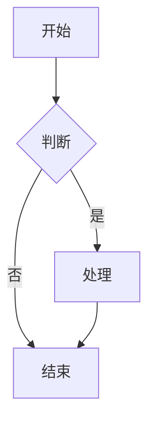
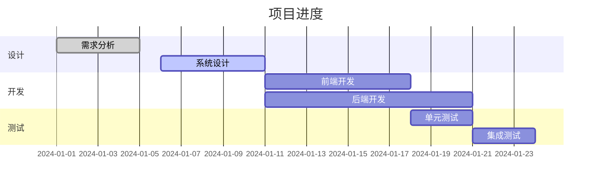
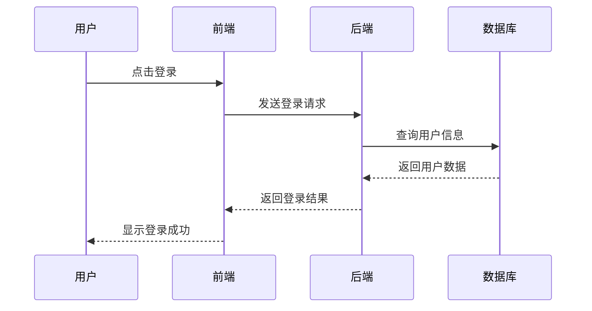

# Markdown Assistant 示例文档

这是一个示例文档，展示了Markdown Assistant的各种功能。

## 三种编辑模式

- **WYSIWYG**: 所见即所得模式，适合普通用户
- **IR**: 即时渲染模式，适合开发者
- **SV**: 分屏预览模式，传统编辑体验

## 数学公式 (LaTeX)

行内公式：$E = mc^2$

块级公式：

$$
\frac{\partial f}{\partial x} = 2\sqrt{a}x
$$

矩阵示例：

$$
\begin{pmatrix}
a & b \\
c & d
\end{pmatrix}
$$

## Mermaid 图表

### 流程图



### 甘特图



### 时序图



## 代码块高亮

### JavaScript

```javascript
function greet(name) {
    console.log(`Hello, ${name}!`);
    return {
        message: 'Welcome',
        timestamp: Date.now()
    };
}

// 调用函数
greet('World');
```

### Python

```python
def fibonacci(n):
    if n <= 1:
        return n
    return fibonacci(n-1) + fibonacci(n-2)

# 计算斐波那契数列
for i in range(10):
    print(fibonacci(i))
```

### Rust

```rust
fn main() {
    let message = String::from("Hello, Tauri!");
    println!("{}", message);
    
    let numbers = vec![1, 2, 3, 4, 5];
    let sum: i32 = numbers.iter().sum();
    println!("Sum: {}", sum);
}
```

## 表格

| 功能 | WYSIWYG | IR | SV |
|------|---------|----|----|
| 所见即所得 | ✅ | ❌ | ❌ |
| 即时渲染 | ❌ | ✅ | ✅ |
| 分屏预览 | ❌ | ❌ | ✅ |
| 适合用户 | 普通用户 | 开发者 | 全部 |

## 其他Markdown功能

### 引用

> 这是一段引用文本
> 
> 可以包含多行
> > 嵌套引用也支持

### 列表

无序列表：
- 项目一
- 项目二
  - 子项目 A
  - 子项目 B
- 项目三

有序列表：
1. 第一步
2. 第二步
3. 第三步

任务列表：
- [x] 已完成的任务
- [ ] 待完成的任务
- [ ] 另一个待完成任务

### 文字格式

**粗体文字**

*斜体文字*

~~删除线~~

`行内代码`

### 链接和图片

[访问Vditor官网](https://b3log.org/vditor/)

---

享受使用Markdown Assistant！
