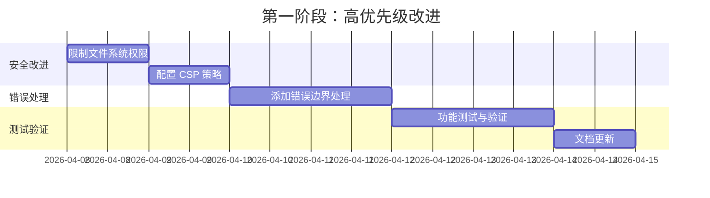
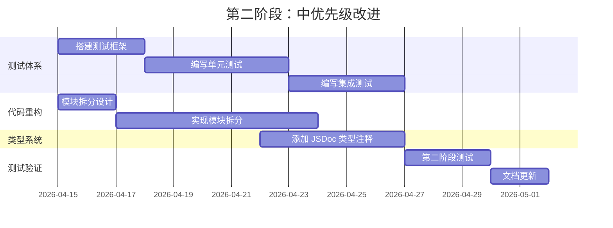
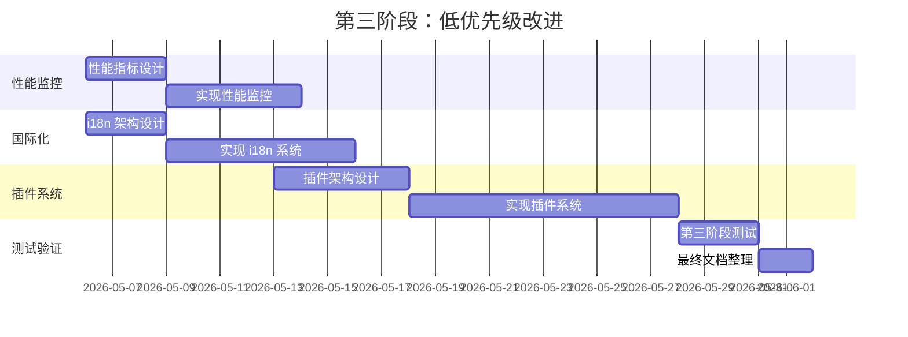
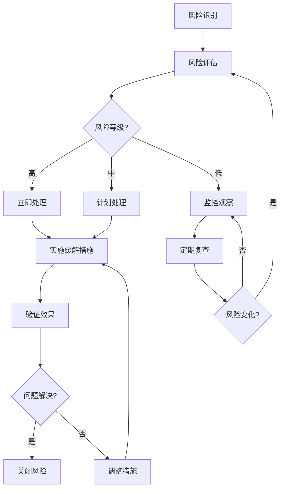

# Markdown Assistant 审计建议实施计划

## 文档信息

| 项目 | 内容 |
|------|------|
| **文档名称** | 审计建议实施计划 |
| **版本** | 1.0.0 |
| **创建日期** | 2026-04-08 |
| **基于审计报告** | 程序审计评估报告 v1.0.0 |

---

## 目录

1. [执行摘要](#执行摘要)
2. [改进建议映射](#改进建议映射)
3. [分阶段实施时间表](#分阶段实施时间表)
4. [技术方案](#技术方案)
5. [质量控制标准](#质量控制标准)
6. [测试策略](#测试策略)
7. [风险管理](#风险管理)
8. [进度报告机制](#进度报告机制)

---

## 执行摘要

本实施计划基于《程序审计评估报告 v1.0.0》中的建议，旨在系统性地完善 Markdown Assistant 项目。

### 总体目标

| 维度 | 当前评分 | 目标评分 | 预计提升 |
|------|----------|----------|----------|
| 安全性 | ⭐⭐⭐⭐ | ⭐⭐⭐⭐⭐ | +1 ⭐ |
| 性能 | ⭐⭐⭐⭐⭐ | ⭐⭐⭐⭐⭐ | 保持 |
| 可维护性 | ⭐⭐⭐ | ⭐⭐⭐⭐⭐ | +2 ⭐ |
| 合规性 | ⭐⭐⭐⭐ | ⭐⭐⭐⭐⭐ | +1 ⭐ |
| **总体** | **⭐⭐⭐⭐** | **⭐⭐⭐⭐⭐** | **+1 ⭐** |

### 预计时间线

| 阶段 | 时长 | 开始日期 | 结束日期 |
|------|------|----------|----------|
| 第一阶段（高优先级） | 1 周 | 2026-04-08 | 2026-04-15 |
| 第二阶段（中优先级） | 3 周 | 2026-04-15 | 2026-05-06 |
| 第三阶段（低优先级） | 4 周 | 2026-05-06 | 2026-06-03 |

**总时长**：约 8 周

---

## 改进建议映射

### 高优先级改进（立即执行）

| 建议项 | 对应模块 | 修改范围 | 风险等级 |
|--------|----------|----------|----------|
| 1. 限制文件系统权限 | Tauri 配置 | `tauri.conf.json` | 中 |
| 2. 配置 CSP 策略 | Tauri 配置 | `tauri.conf.json` | 低 |
| 3. 添加错误边界处理 | 前端错误处理 | `main.js` | 低 |

### 中优先级改进（短期执行）

| 建议项 | 对应模块 | 修改范围 | 风险等级 |
|--------|----------|----------|----------|
| 1. 添加自动化测试 | 测试体系 | 新建测试目录和文件 | 中 |
| 2. 重构代码结构 | 代码组织 | `main.js` 拆分 | 高 |
| 3. 添加类型检查 | 类型系统 | JSDoc 或 TypeScript | 中 |

### 低优先级改进（长期规划）

| 建议项 | 对应模块 | 修改范围 | 风险等级 |
|--------|----------|----------|----------|
| 1. 性能监控 | 性能模块 | 新建性能监控代码 | 中 |
| 2. 国际化支持 | 国际化模块 | 新建 i18n 系统 | 中 |
| 3. 插件系统 | 插件架构 | 设计和实现插件系统 | 高 |

---

## 分阶段实施时间表

### 第一阶段：高优先级改进（2026-04-08 至 2026-04-15）



#### 任务分解

| 任务 ID | 任务描述 | 责任人 | 预计工时 | 开始日期 | 结束日期 | 依赖项 |
|---------|----------|--------|----------|----------|----------|--------|
| **P1-T1** | 限制文件系统权限范围 | 开发人员 A | 4h | 2026-04-08 | 2026-04-08 | 无 |
| **P1-T2** | 配置内容安全策略（CSP） | 开发人员 A | 4h | 2026-04-09 | 2026-04-09 | P1-T1 |
| **P1-T3** | 添加全局错误边界处理 | 开发人员 A | 8h | 2026-04-10 | 2026-04-11 | P1-T2 |
| **P1-T4** | 第一阶段功能测试 | 测试人员 | 16h | 2026-04-12 | 2026-04-13 | P1-T3 |
| **P1-T5** | 更新实施计划和文档 | 开发人员 A | 4h | 2026-04-14 | 2026-04-14 | P1-T4 |
| **P1-T6** | 第一阶段总结与提交 | 开发人员 A | 4h | 2026-04-15 | 2026-04-15 | P1-T5 |

**第一阶段总工时**：约 40 小时

#### 交付物

- [ ] 修改后的 `tauri.conf.json`
- [ ] 增强错误处理的 `main.js`
- [ ] 第一阶段测试报告
- [ ] 第一阶段进度报告

---

### 第二阶段：中优先级改进（2026-04-15 至 2026-05-06）



#### 任务分解

| 任务 ID | 任务描述 | 责任人 | 预计工时 | 开始日期 | 结束日期 | 依赖项 |
|---------|----------|--------|----------|----------|----------|--------|
| **P2-T1** | 选择并搭建测试框架（Vitest） | 开发人员 B | 12h | 2026-04-15 | 2026-04-17 | 无 |
| **P2-T2** | 设计模块拆分方案 | 开发人员 A | 8h | 2026-04-15 | 2026-04-16 | 无 |
| **P2-T3** | 编写核心功能单元测试 | 开发人员 B | 20h | 2026-04-18 | 2026-04-22 | P2-T1 |
| **P2-T4** | 实现代码模块拆分 | 开发人员 A | 28h | 2026-04-17 | 2026-04-25 | P2-T2 |
| **P2-T5** | 添加 JSDoc 类型注释 | 开发人员 A | 20h | 2026-04-22 | 2026-04-26 | P2-T4 |
| **P2-T6** | 编写集成测试 | 开发人员 B | 16h | 2026-04-23 | 2026-04-26 | P2-T3 |
| **P2-T7** | 第二阶段功能测试 | 测试人员 | 24h | 2026-04-27 | 2026-04-29 | P2-T4, P2-T5, P2-T6 |
| **P2-T8** | 更新开发文档 | 开发人员 A | 8h | 2026-04-30 | 2026-05-02 | P2-T7 |
| **P2-T9** | 第二阶段总结与提交 | 开发人员 A | 4h | 2026-05-05 | 2026-05-06 | P2-T8 |

**第二阶段总工时**：约 140 小时

#### 交付物

- [ ] 测试框架配置文件
- [ ] 单元测试套件（≥ 80% 覆盖率）
- [ ] 集成测试套件
- [ ] 模块化后的代码结构
- [ ] JSDoc 类型注释
- [ ] 第二阶段测试报告
- [ ] 更新后的开发手册

---

### 第三阶段：低优先级改进（2026-05-06 至 2026-06-03）



#### 任务分解

| 任务 ID | 任务描述 | 责任人 | 预计工时 | 开始日期 | 结束日期 | 依赖项 |
|---------|----------|--------|----------|----------|----------|--------|
| **P3-T1** | 性能指标收集方案设计 | 开发人员 C | 12h | 2026-05-06 | 2026-05-08 | 无 |
| **P3-T2** | i18n 国际化架构设计 | 开发人员 A | 12h | 2026-05-06 | 2026-05-08 | 无 |
| **P3-T3** | 实现性能监控模块 | 开发人员 C | 20h | 2026-05-09 | 2026-05-13 | P3-T1 |
| **P3-T4** | 插件系统架构设计 | 开发人员 A | 20h | 2026-05-09 | 2026-05-13 | P3-T2 |
| **P3-T5** | 实现 i18n 国际化系统 | 开发人员 A | 28h | 2026-05-09 | 2026-05-16 | P3-T2 |
| **P3-T6** | 实现插件系统核心 | 开发人员 A | 40h | 2026-05-14 | 2026-05-27 | P3-T4 |
| **P3-T7** | 第三阶段全面测试 | 测试人员 | 32h | 2026-05-28 | 2026-05-31 | P3-T3, P3-T5, P3-T6 |
| **P3-T8** | 最终文档整理与更新 | 开发人员 A | 16h | 2026-06-01 | 2026-06-02 | P3-T7 |
| **P3-T9** | 项目总结与发布准备 | 开发人员 A | 8h | 2026-06-03 | 2026-06-03 | P3-T8 |

**第三阶段总工时**：约 188 小时

#### 交付物

- [ ] 性能监控模块
- [ ] i18n 国际化系统
- [ ] 插件系统核心架构
- [ ] 完整的测试报告
- [ ] 最终版本文档
- [ ] 项目总结报告

---

## 技术方案

### 第一阶段技术方案

#### 1. 限制文件系统权限

**修改文件**：`tauri.conf.json`

**当前配置**：
```json
"fs": {
  "scope": ["**"]
}
```

**目标配置**：
```json
"fs": {
  "scope": [
    "$DOCUMENT/*",
    "$DESKTOP/*",
    "$HOME/Downloads/*"
  ]
}
```

**技术栈**：Tauri 配置文件

**实现方法**：
1. 修改 `tauri.conf.json` 中的 `fs.scope` 配置
2. 使用 Tauri 提供的路径变量（`$DOCUMENT`、`$DESKTOP`、`$HOME`）
3. 限制文件访问范围到常用文档目录

**验证方法**：
- 测试打开非允许目录的文件应失败
- 测试打开允许目录的文件应正常工作

---

#### 2. 配置 CSP 策略

**修改文件**：`tauri.conf.json`

**当前配置**：
```json
"security": {
  "csp": null
}
```

**目标配置**：
```json
"security": {
  "csp": "default-src 'self'; script-src 'self' 'unsafe-inline'; style-src 'self' 'unsafe-inline'; img-src 'self' data: https:; font-src 'self' data:;"
}
```

**技术栈**：Tauri 配置、内容安全策略（CSP）

**实现方法**：
1. 在 `tauri.conf.json` 中配置 CSP 策略
2. 允许必要的资源来源（`'self'`、`data:`、`https:`）
3. 限制 inline script 和 style（根据需要调整）

**验证方法**：
- 检查浏览器控制台是否有 CSP 违规警告
- 验证所有功能正常工作

---

#### 3. 添加错误边界处理

**修改文件**：`main.js`

**新增代码**：
```javascript
function initErrorHandling() {
  window.addEventListener('error', (event) => {
    console.error('Global error:', event.error);
    showErrorNotification('发生了一个错误，请刷新页面重试');
    logError(event.error);
  });

  window.addEventListener('unhandledrejection', (event) => {
    console.error('Unhandled promise rejection:', event.reason);
    showErrorNotification('操作失败，请重试');
    logError(event.reason);
  });
}

function showErrorNotification(message) {
  message(message, { type: 'error', duration: 5000 });
}

function logError(error) {
  try {
    const errorLog = {
      timestamp: new Date().toISOString(),
      message: error?.message || String(error),
      stack: error?.stack,
      url: window.location.href
    };
    
    console.error('Error logged:', errorLog);
  } catch (e) {
    console.error('Failed to log error:', e);
  }
}
```

**技术栈**：Vanilla JavaScript、Tauri dialog API

**实现方法**：
1. 添加 `window.onerror` 监听
2. 添加 `unhandledrejection` 监听
3. 显示友好的错误通知
4. 记录错误日志到控制台

**验证方法**：
- 模拟各种错误情况
- 验证错误通知正确显示
- 验证错误被正确记录

---

### 第二阶段技术方案

#### 1. 添加自动化测试

**技术选型**：Vitest

**目录结构**：
```
MarkdownAssistant/
├── tests/
│   ├── unit/
│   │   ├── fileOperations.test.js
│   │   ├── themeSystem.test.js
│   │   └── historyManager.test.js
│   ├── integration/
│   │   └── app.test.js
│   └── setup.js
├── vite.config.js
└── package.json
```

**package.json 更新**：
```json
{
  "devDependencies": {
    "vitest": "^1.0.0",
    "@testing-library/dom": "^9.0.0",
    "jsdom": "^23.0.0"
  },
  "scripts": {
    "test": "vitest",
    "test:coverage": "vitest --coverage"
  }
}
```

**测试覆盖率目标**：≥ 80%

**实现方法**：
1. 安装 Vitest 和相关依赖
2. 配置测试环境
3. 编写单元测试
4. 编写集成测试
5. 设置 CI/CD（可选）

---

#### 2. 重构代码结构

**目标模块拆分**：
```
src/
├── index.js                 # 入口文件
├── modules/
│   ├── editor.js           # 编辑器模块
│   ├── fileManager.js      # 文件管理模块
│   ├── historyManager.js   # 历史记录模块
│   ├── themeManager.js     # 主题管理模块
│   ├── pdfExporter.js      # PDF 导出模块
│   └── uiComponents.js     # UI 组件模块
├── utils/
│   ├── errorHandler.js     # 错误处理工具
│   ├── constants.js        # 常量定义
│   └── helpers.js          # 辅助函数
└── styles/
    └── index.css
```

**技术栈**：ES6 Modules

**实现方法**：
1. 设计模块接口
2. 按功能拆分 `main.js`
3. 使用 `import`/`export`
4. 保持功能完整性
5. 逐步迁移和测试

---

#### 3. 添加类型检查

**方案选择**：JSDoc（渐进式，风险较低）

**示例**：
```javascript
/**
 * @typedef {Object} FileHistoryItem
 * @property {string} path - 文件路径
 * @property {string} name - 文件名
 * @property {number} time - 时间戳
 */

/**
 * 获取文件历史记录
 * @returns {FileHistoryItem[]} 历史记录数组
 */
function getFileHistory() {
  // 实现
}

/**
 * 保存文件
 * @param {string} filePath - 文件路径
 * @param {string} content - 文件内容
 * @returns {Promise<void>}
 */
async function saveFile(filePath, content) {
  // 实现
}
```

**技术栈**：JSDoc、TypeScript（可选）

**实现方法**：
1. 为所有公共函数添加 JSDoc
2. 定义类型定义文件
3. 配置 VS Code 类型检查
4. 可选：迁移到 TypeScript

---

### 第三阶段技术方案（概述）

#### 1. 性能监控

**指标收集**：
- 启动时间
- 文件加载时间
- 编辑器响应时间
- 内存使用情况

**实现**：使用 `performance` API

---

#### 2. 国际化支持

**架构设计**：
```
src/
└── i18n/
    ├── index.js
    ├── locales/
    │   ├── zh-CN.json
    │   ├── en-US.json
    │   └── ja-JP.json
    └── detector.js
```

---

#### 3. 插件系统

**架构设计**：
- 插件生命周期管理
- 插件 API 定义
- 插件加载器
- 示例插件

---

## 质量控制标准

### 阶段验收指标

#### 第一阶段验收

| 验收项 | 验收标准 | 验证方法 |
|--------|----------|----------|
| 文件系统权限 | 只能访问允许的目录 | 尝试访问不同目录 |
| CSP 策略 | 无 CSP 违规警告 | 检查浏览器控制台 |
| 错误处理 | 错误有友好提示 | 模拟错误场景 |
| 功能完整性 | 所有现有功能正常 | 完整功能测试 |
| 代码质量 | 无 ESLint 错误 | 运行 lint 检查 |

#### 第二阶段验收

| 验收项 | 验收标准 | 验证方法 |
|--------|----------|----------|
| 测试覆盖率 | ≥ 80% | 查看覆盖率报告 |
| 代码模块化 | 至少 5 个模块 | 检查目录结构 |
| 类型注释 | 公共函数 100% 有 JSDoc | 代码审查 |
| 功能完整性 | 所有功能正常工作 | 完整功能测试 |
| 无回归 bug | 无新增 bug | 回归测试 |

#### 第三阶段验收

| 验收项 | 验收标准 | 验证方法 |
|--------|----------|----------|
| 性能监控 | 关键指标可收集 | 验证指标日志 |
| 国际化 | 至少支持 2 种语言 | 语言切换测试 |
| 插件系统 | 可加载示例插件 | 插件加载测试 |
| 文档完整性 | 所有文档更新完成 | 文档审查 |
| 最终评分 | 总体 ≥ ⭐⭐⭐⭐⭐ | 重新审计评估 |

---

## 测试策略

### 1. 单元测试

**测试框架**：Vitest

**测试范围**：
- 文件操作函数
- 主题管理函数
- 历史记录管理函数
- 工具函数

**测试覆盖率目标**：≥ 80%

---

### 2. 集成测试

**测试场景**：
- 完整的文件打开-编辑-保存流程
- 主题切换流程
- 历史记录管理流程
- PDF 导出流程

---

### 3. 用户验收测试（UAT）

**测试用例**：
| ID | 测试用例 | 预期结果 |
|----|----------|----------|
| UAT-01 | 新建 Markdown 文件并编辑 | 成功创建和编辑 |
| UAT-02 | 打开现有 Markdown 文件 | 成功打开并显示内容 |
| UAT-03 | 保存文件 | 成功保存到指定位置 |
| UAT-04 | 切换主题 | 主题立即生效 |
| UAT-05 | 导出为 PDF | 成功导出 PDF |
| UAT-06 | 查看历史记录 | 正确显示历史文件 |
| UAT-07 | 错误场景处理 | 显示友好错误提示 |

---

## 风险管理

### 风险登记册

| 风险 ID | 风险描述 | 影响 | 可能性 | 缓解措施 | 责任人 |
|---------|----------|------|--------|----------|--------|
| R-001 | 文件权限限制导致现有功能失效 | 高 | 中 | 充分测试，提供回滚方案 | 开发人员 A |
| R-002 | CSP 策略过严导致资源加载失败 | 高 | 低 | 逐步调整 CSP 策略 | 开发人员 A |
| R-003 | 代码重构引入回归 bug | 高 | 中 | 充分测试，保持小步迭代 | 开发人员 A/B |
| R-004 | 测试覆盖率不达标 | 中 | 中 | 优先测试核心功能 | 开发人员 B |
| R-005 | 进度延期 | 中 | 中 | 设置缓冲时间，定期检查 | 项目经理 |

### 风险应对流程



---

## 进度报告机制

### 定期报告

| 报告类型 | 频率 | 内容 | 接收人 |
|----------|------|------|--------|
| 每日站会 | 每日 | 昨日进度、今日计划、 blockers | 团队 |
| 周进度报告 | 每周 | 本周完成、下周计划、风险 | 所有干系人 |
| 阶段总结报告 | 每阶段 | 阶段成果、验收情况、经验 | 所有干系人 |

### 进度报告模板

#### 周进度报告

```markdown
# 周进度报告 - 第 X 周

## 本周完成
- [ ] 任务 1
- [ ] 任务 2

## 下周计划
- [ ] 任务 A
- [ ] 任务 B

## 风险与问题
- 风险 1：描述
- 问题 1：描述

## 变更记录
- 变更 1：描述
```

### Git 提交策略

**分支策略**：
- `master` - 主分支（稳定）
- `feature/phase1-*` - 第一阶段功能分支
- `feature/phase2-*` - 第二阶段功能分支
- `feature/phase3-*` - 第三阶段功能分支

**提交信息规范**：
```
<Phase>-<Type>: <subject>

<body>
```

示例：
```
P1-Fix: 修复文件权限配置问题

- 更新 tauri.conf.json 中的 fs.scope
- 添加测试验证权限限制
```

---

## 附录

### A. 参考文档

- [程序审计评估报告 v1.0.0](./程序审计评估报告.md)
- [程序开发手册](./程序开发手册.md)
- [用户使用手册](./用户使用手册.md)

### B. 术语表

| 术语 | 说明 |
|------|------|
| CSP | Content Security Policy，内容安全策略 |
| JSDoc | JavaScript 文档注释标准 |
| UAT | User Acceptance Testing，用户验收测试 |
| CI/CD | Continuous Integration/Continuous Deployment |

---

*文档版本：1.0.0*  
*最后更新：2026-04-08*
