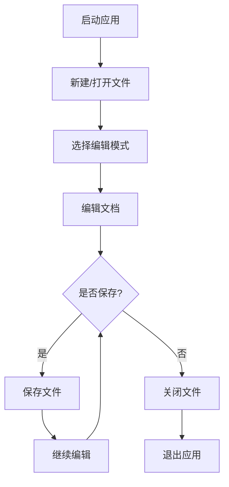

# Markdown Assistant 用户使用手册

## 目录

1. [产品简介](#产品简介)
2. [功能特性](#功能特性)
3. [系统要求](#系统要求)
4. [安装配置](#安装配置)
5. [操作指南](#操作指南)
6. [快捷键参考](#快捷键参考)
7. [常见问题解答](#常见问题解答)
8. [注意事项](#注意事项)

---

## 产品简介

Markdown Assistant 是一款基于 Tauri 和 Vditor 开发的专业 Markdown 编辑器，提供简洁高效的文档创作体验。支持多种编辑模式、主题切换、PDF 导出等功能，适合开发者、写作者和内容创作者使用。

---

## 功能特性

### 核心功能

- **多模式编辑**：支持三种编辑模式
  - **WYSIWYG（所见即所得）**：像使用 Word 一样编辑
  - **IR（即时渲染）**：输入后即时渲染效果
  - **SV（分屏预览）**：左侧编辑，右侧实时预览

- **主题系统**：三种预设主题，满足不同使用场景
  - **浅色主题**：清爽明亮，适合日间使用
  - **深色主题**：护眼舒适，适合夜间使用
  - **灰色主题**：柔和中性，适合长时间阅读

- **文件管理**：完整的文件操作功能
  - 新建文件
  - 打开本地文件
  - 保存文件
  - 另存为
  - 关闭文件

- **历史记录**：自动记录最近打开的文件
  - 查看历史文件列表
  - 快速打开历史文件
  - 清除历史记录

- **PDF 导出**：将 Markdown 文档导出为 PDF
  - 支持多种页面大小（A4、Letter、Legal）
  - 支持纵向/横向页面方向
  - 支持边距设置

### 编辑特性

- **富文本编辑**：加粗、斜体、删除线等基础格式
- **代码高亮**：支持多种编程语言的语法高亮
- **数学公式**：支持 KaTeX 数学公式渲染
- **流程图**：支持 Mermaid 流程图绘制
- **表格编辑**：方便的表格创建和编辑
- **图片插入**：支持本地图片和网络图片
- **TOC 目录**：自动生成文档目录

---

## 系统要求

### 最低配置

- **操作系统**：Windows 10 及以上
- **处理器**：Intel Core i3 或同等性能
- **内存**：4GB RAM
- **存储空间**：100MB 可用空间

### 推荐配置

- **操作系统**：Windows 10/11
- **处理器**：Intel Core i5 或同等性能
- **内存**：8GB RAM 或更多
- **存储空间**：500MB 可用空间

---

## 安装配置

### 安装步骤

1. **下载安装包**
   - 从官方发布页面下载最新的 `.msi` 安装包

2. **运行安装程序**
   - 双击下载的安装包
   - 按照安装向导提示完成安装

3. **启动应用**
   - 从开始菜单或桌面快捷方式启动 Markdown Assistant

### 首次使用

首次启动应用后，您将看到：
- 顶部工具栏，包含所有操作按钮
- 中央编辑区域，默认使用分屏预览模式
- 右侧主题和编辑模式选择

---

## 操作指南

### 基本操作流程



### 文件操作

#### 新建文件

1. 点击工具栏左侧的「新建文件」按钮（📄）
2. 或使用快捷键 `Ctrl + N`
3. 编辑区域将被清空，文件名显示为「未命名文件」

#### 打开文件

1. 点击工具栏左侧的「打开文件」按钮（📂）
2. 或使用快捷键 `Ctrl + O`
3. 在弹出的文件选择对话框中选择要打开的 Markdown 文件
4. 文件内容将加载到编辑器中

#### 保存文件

**保存当前文件**

1. 点击工具栏左侧的「保存文件」按钮（💾）
2. 或使用快捷键 `Ctrl + S`
3. 如果是新建文件，将弹出保存对话框

**另存为**

1. 点击工具栏左侧的「另存为」按钮（📝）
2. 或使用快捷键 `Ctrl + Shift + S`
3. 在弹出的保存对话框中选择保存位置和文件名

#### 关闭文件

1. 点击工具栏左侧的「关闭文件」按钮（✕）
2. 或使用快捷键 `Ctrl + W`
3. 如果文件有未保存的修改，将提示确认

### 历史文件

#### 查看历史文件

1. 点击工具栏左侧的「历史文件」按钮（🕐）
2. 将弹出历史文件列表弹窗

#### 打开历史文件

1. 在历史文件列表中点击要打开的文件
2. 如果当前文件有未保存的修改，将提示确认

#### 清除历史记录

1. 在历史文件列表弹窗中点击「清除全部历史」按钮
2. 确认后将清空所有历史记录

### 编辑模式切换

应用支持三种编辑模式，可通过工具栏右侧的模式按钮切换：

#### WYSIWYG 模式

- 点击「WYSIWYG」按钮
- 所见即所得模式，类似传统文字编辑器
- 适合不熟悉 Markdown 语法的用户

#### IR 模式

- 点击「IR」按钮
- 即时渲染模式，输入后立即看到渲染效果
- 适合快速编辑和预览

#### SV 模式（默认）

- 点击「SV」按钮
- 分屏预览模式，左侧编辑，右侧预览
- 适合同时查看源码和渲染效果

### 主题切换

应用提供三种主题，可通过工具栏右侧的主题按钮切换：

#### 浅色主题

- 点击「☀️ 浅色」按钮
- 清爽明亮的界面
- 适合日间使用，减少眼睛疲劳

#### 深色主题

- 点击「🌙 深色」按钮
- 护眼的深色界面
- 适合夜间使用，降低蓝光伤害

#### 灰色主题

- 点击「🌫️ 灰色」按钮
- 柔和的灰色调界面
- 适合长时间阅读，减少视觉刺激

**主题持久化**：选择的主题会自动保存，下次启动应用时自动应用。

### PDF 导出

1. 点击工具栏左侧的「导出为PDF」按钮（📄 PDF）
2. 在弹出的 PDF 导出对话框中设置选项：
   - **页面大小**：A4、Letter、Legal
   - **页面方向**：纵向、横向
   - **边距**：默认、无、最小
3. 点击「导出」按钮
4. 在弹出的打印对话框中选择打印机或保存为 PDF

---

## 快捷键参考

### 文件操作

| 快捷键 | 功能 |
|--------|------|
| `Ctrl + N` | 新建文件 |
| `Ctrl + O` | 打开文件 |
| `Ctrl + S` | 保存文件 |
| `Ctrl + Shift + S` | 另存为 |
| `Ctrl + W` | 关闭文件 |

### 编辑操作

| 快捷键 | 功能 |
|--------|------|
| `Ctrl + B` | 加粗 |
| `Ctrl + I` | 斜体 |
| `Ctrl + U` | 下划线 |
| `Ctrl + Z` | 撤销 |
| `Ctrl + Y` | 重做 |
| `Tab` | 缩进 |
| `Shift + Tab` | 取消缩进 |

### 窗口操作

| 快捷键 | 功能 |
|--------|------|
| `Esc` | 关闭弹窗 |

---

## 常见问题解答

### 编辑相关

**Q: 如何插入图片？**
A: 点击工具栏的「图片」按钮，或直接拖拽图片到编辑器中。

**Q: 如何创建表格？**
A: 点击工具栏的「表格」按钮，选择表格大小，或直接使用 Markdown 表格语法。

**Q: 如何插入代码块？**
A: 点击工具栏的「代码」按钮，或使用三个反引号（```）包裹代码。

**Q: 数学公式如何使用？**
A: 使用 `$` 包裹行内公式，使用 `$$` 包裹块级公式。

### 文件相关

**Q: 支持哪些文件格式？**
A: 主要支持 `.md`（Markdown）格式，也可以打开 `.txt` 等文本文件。

**Q: 文件保存位置在哪里？**
A: 您可以在保存时选择任意位置，应用不会强制保存到特定目录。

**Q: 如何恢复误删除的文件？**
A: 应用不提供文件恢复功能，请定期备份重要文件。

### 主题相关

**Q: 主题设置会保存吗？**
A: 会的，您选择的主题会自动保存到本地存储，下次启动时自动应用。

**Q: 可以自定义主题吗？**
A: 当前版本不支持自定义主题，仅提供三种预设主题。

### 导出相关

**Q: PDF 导出后格式不对怎么办？**
A: 可以尝试调整页面大小、方向或边距设置，或使用浏览器打印预览功能调整。

**Q: 导出的 PDF 中中文显示乱码？**
A: 请确保系统中安装了中文字体，PDF 导出使用系统字体。

---

## 注意事项

### 使用安全

1. **定期保存**：编辑过程中请定期保存文件，避免意外关闭导致数据丢失。
2. **备份重要文件**：重要文档建议定期备份到其他位置。
3. **不要编辑系统文件**：避免编辑系统或其他程序的配置文件。

### 性能优化

1. **大文件处理**：编辑超大文件（> 10MB）时可能会有性能问题，建议拆分文件。
2. **图片优化**：插入的图片建议适当压缩，避免文件过大。

### 兼容性

1. **Markdown 语法**：应用遵循标准 Markdown 语法，同时支持部分 GFM 扩展。
2. **文件编码**：默认使用 UTF-8 编码，确保文件兼容性。

### 隐私保护

1. **本地存储**：所有文件操作均在本地完成，不会上传到任何服务器。
2. **历史记录**：历史文件列表仅保存在本地，不会共享。

---

## 技术支持

如遇到问题或需要帮助，请通过以下方式联系我们：

- 提交 Issue 到项目仓库
- 查看项目文档和常见问题

---

*文档版本：1.0.0*  
*最后更新：2026-04-08*
