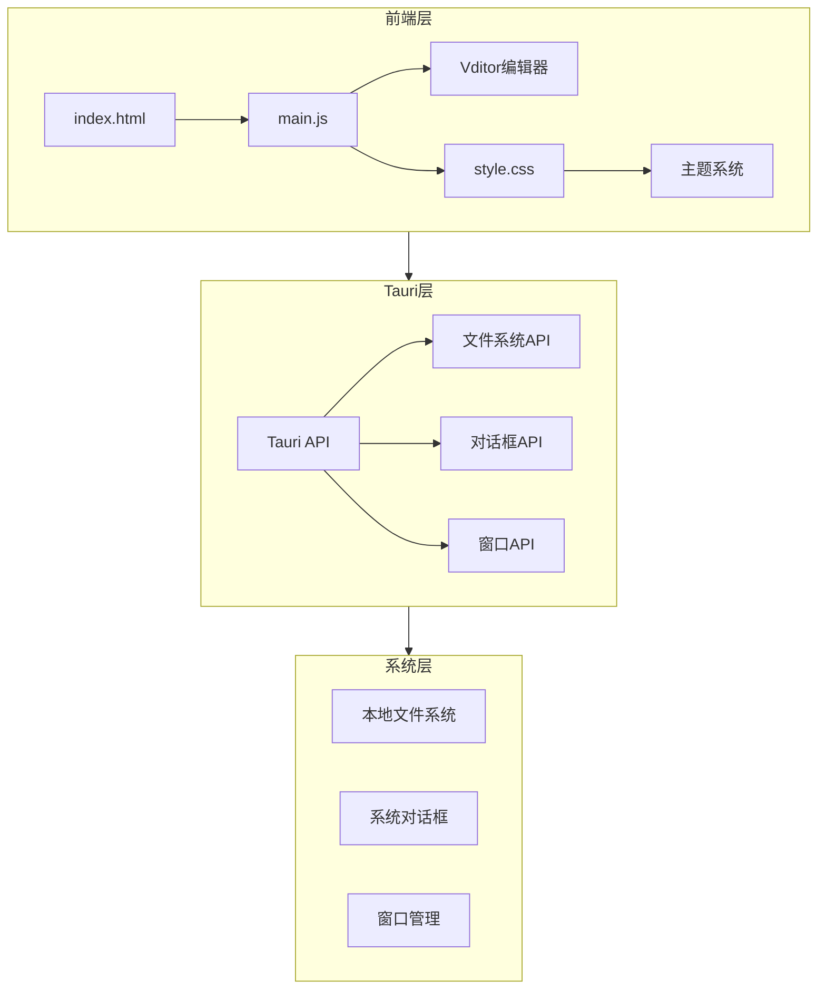
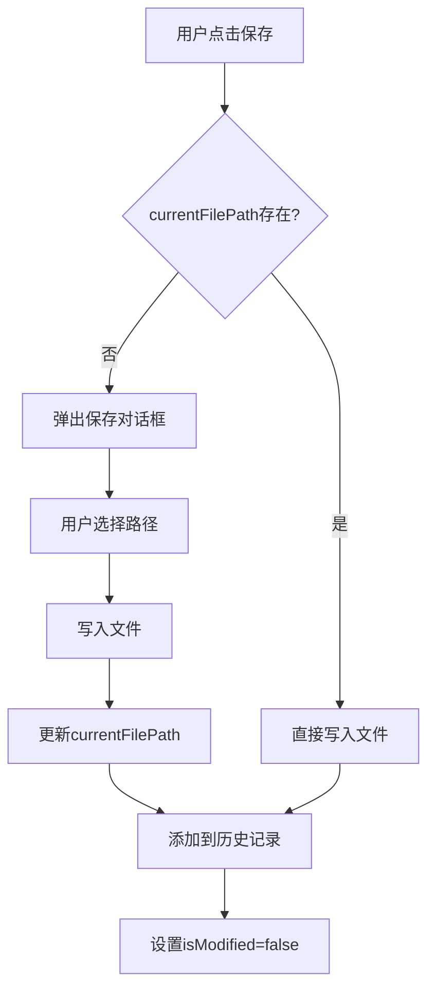
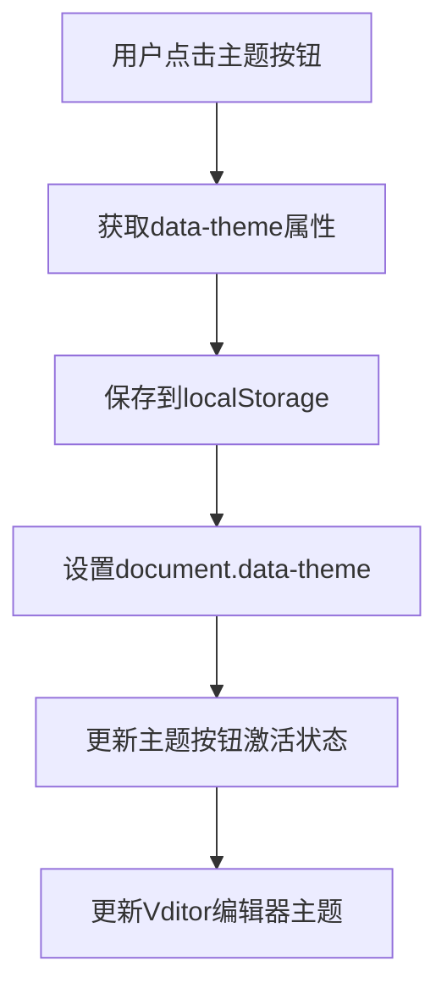

# Markdown Assistant 程序开发手册

## 目录

1. [项目概述](#项目概述)
2. [技术架构](#技术架构)
3. [项目结构](#项目结构)
4. [模块说明](#模块说明)
5. [核心功能实现](#核心功能实现)
6. [开发规范](#开发规范)
7. [调试与测试](#调试与测试)
8. [扩展开发](#扩展开发)
9. [构建与部署](#构建与部署)

---

## 项目概述

### 项目简介

Markdown Assistant 是一款基于 Tauri 和 Vditor 开发的专业 Markdown 桌面编辑器，旨在为开发者、写作者和内容创作者提供高效、美观的文档创作体验。

### 技术栈

- **前端框架**：Vanilla JavaScript（无框架）
- **桌面应用框架**：Tauri 1.5
- **Markdown 编辑器**：Vditor 3.10.3
- **构建工具**：Vite 5.0
- **PDF 导出**：html2pdf.js 0.14.0
- **编程语言**：Rust（Tauri 后端）+ JavaScript（前端）
- **包管理器**：npm

### 版本信息

- **当前版本**：1.0.0
- **最后更新**：2026-04-08

---

## 技术架构

### 系统架构图



### 架构设计原则

1. **前后端分离**：前端负责 UI 和交互，Tauri 后端负责系统级操作
2. **模块化设计**：功能模块独立，便于维护和扩展
3. **状态管理**：使用全局变量和 localStorage 管理应用状态
4. **事件驱动**：通过事件监听和回调函数处理用户交互

---

## 项目结构

### 目录结构

```
MarkdownAssistant/
├── src-tauri/                 # Tauri 后端代码
│   ├── icons/                 # 应用图标
│   ├── src/
│   │   └── main.rs           # Rust 主程序
│   ├── Cargo.toml             # Rust 依赖配置
│   ├── build.rs               # 构建脚本
│   └── tauri.conf.json        # Tauri 配置文件
├── index.html                 # 主 HTML 文件
├── main.js                    # 主 JavaScript 文件
├── style.css                  # 样式文件
├── vite.config.js             # Vite 配置
├── package.json               # npm 依赖配置
├── package-lock.json          # npm 依赖锁定文件
└── icon.png                   # 应用图标源文件
```

### 关键文件说明

| 文件 | 说明 |
|------|------|
| `index.html` | 应用入口 HTML，包含 UI 结构 |
| `main.js` | 核心业务逻辑，所有功能实现 |
| `style.css` | 样式定义，包含主题系统 |
| `tauri.conf.json` | Tauri 配置，权限、窗口等设置 |
| `package.json` | npm 脚本和依赖管理 |

---

## 模块说明

### 1. 编辑器模块（Vditor Integration）

**职责**：负责 Markdown 编辑器的初始化、配置和交互

**核心函数**：
- `initVditor(mode, initialContent)` - 初始化 Vditor 编辑器
- `switchMode(mode)` - 切换编辑模式

**配置项**（`main.js:41-122`）：
```javascript
vditor = new Vditor('vditor', {
  height: '100%',
  mode: mode,
  theme: vditorTheme,
  icon: 'material',
  cache: { enable: false },
  counter: { enable: true, type: 'lines' },
  preview: {
    theme: { current: vditorTheme },
    hljs: { enable: true, style: 'github' },
    math: { engine: 'KaTeX' },
    mermaid: { enable: true }
  }
})
```

### 2. 文件管理模块

**职责**：负责文件的新建、打开、保存、关闭等操作

**核心函数**：
- `newFile()` - 新建文件
- `openFile()` - 打开文件
- `saveFile()` - 保存文件
- `saveAsFile()` - 另存为
- `closeFile()` - 关闭文件

**状态变量**：
- `currentFilePath` - 当前打开的文件路径
- `isModified` - 文件是否已修改

### 3. 历史记录模块

**职责**：管理最近打开的文件历史

**核心函数**：
- `getFileHistory()` - 获取历史记录
- `addToHistory(filePath)` - 添加到历史
- `removeFromHistory(filePath)` - 从历史移除
- `clearAllHistory()` - 清空历史
- `renderHistoryList()` - 渲染历史列表
- `openHistoryFile(filePath)` - 打开历史文件

**配置常量**：
- `HISTORY_KEY` - localStorage 键名
- `MAX_HISTORY` - 最大历史记录数（50）

### 4. 主题系统模块

**职责**：管理应用主题切换和持久化

**核心函数**：
- `getCurrentTheme()` - 获取当前主题
- `setTheme(theme)` - 设置主题
- `updateVditorTheme(theme)` - 更新 Vditor 主题
- `initTheme()` - 初始化主题

**配置常量**：
- `THEME_KEY` - localStorage 键名
- `DEFAULT_THEME` - 默认主题（'light'）

**主题定义**（`style.css:15-67`）：
- `:root` - 浅色主题
- `[data-theme="dark"]` - 深色主题
- `[data-theme="gray"]` - 灰色主题

### 5. PDF 导出模块

**职责**：将 Markdown 文档导出为 PDF

**核心函数**：
- `openPdfModal()` - 打开导出对话框
- `closePdfModal()` - 关闭导出对话框
- `exportToPdf()` - 执行 PDF 导出

**导出方式**：
- 使用浏览器原生打印 API（`window.print()`）
- 支持页面大小、方向、边距配置

### 6. UI 交互模块

**职责**：处理用户界面交互

**核心函数**：
- `setModified(modified)` - 设置修改状态
- `updateCurrentFileName(name)` - 更新文件名显示
- `updateModeButtons(mode)` - 更新模式按钮状态

---

## 核心功能实现

### 1. 文件操作流程



### 2. 主题切换流程



### 3. 状态管理

**全局状态变量**（`main.js:7-13`）：
```javascript
let vditor;                    // Vditor 编辑器实例
let currentFilePath = null;     // 当前文件路径
let isModified = false;         // 修改状态
const HISTORY_KEY = '...';      // 历史记录键
const MAX_HISTORY = 50;         // 最大历史数
const THEME_KEY = '...';         // 主题键
const DEFAULT_THEME = 'light';   // 默认主题
```

**localStorage 存储**：
- 文件历史：`markdown_assistant_file_history`
- 主题偏好：`markdown_assistant_theme`

### 4. 事件绑定

**DOMContentLoaded 事件**（`main.js:705-742`）：
- 初始化主题
- 初始化 Vditor
- 绑定所有按钮事件
- 绑定键盘快捷键
- 绑定窗口关闭事件

---

## 开发规范

### 代码风格指南

#### JavaScript 规范

1. **命名约定**（遵循用户规则）
   - 类名/方法名：PascalCase（如 `OrderService`）
   - 变量/参数名：camelCase（如 `orderList`）
   - 私有字段：下划线开头（如 `_connectionString`）
   - 常量：全大写加下划线（如 `MAX_RETRY_COUNT`）

2. **代码结构**
   - 缩进：4个空格
   - 大括号：独行放置
   - 方法长度：单一职责，避免过长

3. **注释规范**
   - 文件头：版权声明、作者、功能描述、修改记录
   - 公共成员：`/// <summary>` XML 文档注释
   - 重要逻辑：中文注释说明业务意图

#### CSS 规范

1. **CSS 变量**
   - 使用 `--` 前缀定义主题变量
   - 集中在 `:root` 中定义默认值
   - 主题覆盖使用 `[data-theme="xxx"]` 选择器

2. **样式组织**
   - 按功能模块分组
   - 使用有意义的类名
   - 避免过度嵌套

### Git 提交规范

**提交消息格式**：
```
<type>: <subject>

<body>
```

**类型（type）**：
- `Feat` - 新功能
- `Fix` - 修复 bug
- `Refactor` - 重构
- `Docs` - 文档更新
- `Style` - 代码格式调整
- `Test` - 测试相关
- `Chore` - 构建/工具相关

**示例**：
```
Feat: 实现完整的主题切换功能

- 新增三种预设主题：浅色、深色、灰色
- 每种主题包含完整的色彩方案定义
- 在工具栏添加主题选择器UI
```

---

## 调试与测试

### 开发环境搭建

1. **安装依赖**
   ```bash
   npm install
   ```

2. **启动开发服务器**
   ```bash
   npm run tauri:dev
   ```

### 调试技巧

1. **浏览器 DevTools**
   - Tauri 开发模式下可以使用浏览器 DevTools
   - 查看 Console 日志
   - 检查元素和样式
   - 使用 Network 面板查看请求

2. **日志输出**
   - 使用 `console.log()` 输出调试信息
   - 使用 `console.warn()` 输出警告
   - 使用 `console.error()` 输出错误

3. **Vditor 调试**
   - 检查 `vditor` 实例是否正确初始化
   - 验证配置参数是否正确
   - 测试 `setValue()` 和 `getValue()` 方法

### 常见问题排查

**问题1：Vditor 编辑器未显示**
- 检查 `#vditor` 元素是否存在
- 确认 Vditor CSS 正确引入
- 查看浏览器控制台错误

**问题2：文件操作失败**
- 检查 `tauri.conf.json` 中的 fs 权限配置
- 确认文件路径格式正确
- 验证文件编码（使用 UTF-8）

**问题3：主题切换不生效**
- 检查 CSS 变量是否正确定义
- 确认 `data-theme` 属性正确设置
- 验证 localStorage 存储是否成功

---

## 扩展开发

### 添加新主题

1. **在 style.css 中添加主题定义**
   ```css
   [data-theme="custom"] {
     --bg-primary: #your-color;
     --text-primary: #your-color;
     /* 其他变量 */
   }
   ```

2. **在 index.html 中添加主题按钮**
   ```html
   <button class="theme-btn" data-theme="custom" title="自定义主题">
     <span class="theme-icon">🎨</span>
     <span class="theme-label">自定义</span>
   </button>
   ```

### 添加新编辑模式

1. **在 index.html 中添加模式按钮**
   ```html
   <button class="btn mode-btn" data-mode="your-mode" title="你的模式">MODE</button>
   ```

2. **确保 Vditor 支持该模式**
   - 参考 Vditor 文档确认模式名称
   - 在 `switchMode()` 函数中处理（如需特殊逻辑）

### 集成新功能

1. **在 main.js 中添加函数**
   ```javascript
   function yourNewFeature() {
     // 功能实现
   }
   ```

2. **在 index.html 中添加 UI**
   ```html
   <button id="yourFeatureBtn" class="btn" title="你的功能">
     <span class="icon">🔧</span>
   </button>
   ```

3. **在 DOMContentLoaded 中绑定事件**
   ```javascript
   document.getElementById('yourFeatureBtn').addEventListener('click', yourNewFeature);
   ```

---

## 构建与部署

### 开发构建

```bash
npm run tauri:dev
```

### 生产构建

```bash
npm run tauri:build
```

### 构建产物

- Windows：`src-tauri/target/release/bundle/msi/*.msi`

### 版本发布流程

1. **更新版本号**
   - `package.json` 中的 `version`
   - `tauri.conf.json` 中的 `version`

2. **运行测试**
   - 手动测试核心功能
   - 验证主题切换
   - 测试文件操作

3. **执行构建**
   ```bash
   npm run tauri:build
   ```

4. **发布安装包**
   - 上传 `.msi` 文件到发布平台
   - 编写发布说明

---

## 参考资料

- [Tauri 官方文档](https://tauri.app/v1/guides/)
- [Vditor 官方文档](https://b3log.org/vditor/)
- [html2pdf.js GitHub](https://github.com/eKoopmans/html2pdf.js)
- [Vite 官方文档](https://vitejs.dev/)

---

*文档版本：1.0.0*  
*最后更新：2026-04-08*
